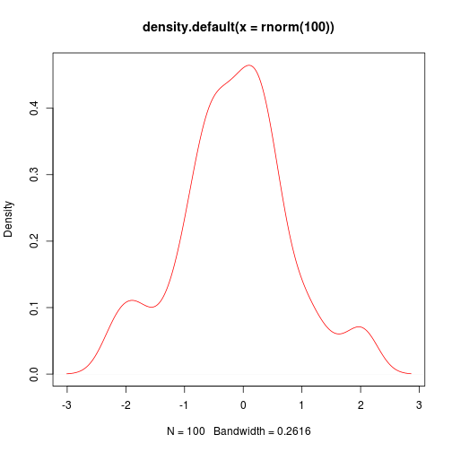

Lecture 1
========================================================

* Large Data Sets
* Modeling and simulations
* Statistical analysis
* Extensive computational task

-----

* Genomics, transcryptomycs
* Computational evolutionary biolo
* Structural biology
* Image analysis
* Quantative ecology

----

#### 3 diensions of languages

* __High__ vs low
* __General__ vs targeted
* __Interpretive__ vs compiled

----

#### Structure of R language

* S language
* Functions written in R itself

----

#### Specific task

* Multiple testing
* MCMC
* Bias 
* Gauss
* Plotting
* Sequencing

----
#### Check graphics system


```r
plot(density(rnorm(100)), col = "red")
```

 

----
#### Variables types


```r
x = 5
x <- 5
assign(x, 5)
```

```
## Error: неправильный первый аргумент
```

```r
x
```

```
## [1] 5
```


----
#### Commands and Basic Functions

function c()


```r
x <- c(1, 3, 6, 7)
```

----
#### Vectors


* numerical
* character
* logical

(factors are not classic vector objects)


```r
char <- c("8", "edge", "turn8k")
logic <- c(TRUE, FALSE, TRUE, FALSE)
```


Dynamic typisation


```r
dynam <- c(8, "dds", TRUE)
dynam <- c(1, 0, 1, 1, TRUE)
dynam
```

```
## [1] 1 0 1 1 1
```


Priority Char->integer->Logic

----

#### Functions

x=function(arg1,arg2,...)

Invocation - function call

args:

* tagged(named)
* positional

Positional:
log(x,base)

```r
log(x, 10)
```

```
## [1] 0.0000 0.4771 0.7782 0.8451
```

Tagged: 
log(base=base,x)

```r
log(base = 10, x)
```

```
## [1] 0.0000 0.4771 0.7782 0.8451
```


----
#### Logical operations

>,<,<=,>=,==

```r
x = 10
x < 5
```

```
## [1] FALSE
```

```r
x > 5
```

```
## [1] TRUE
```

```r
x == 10
```

```
## [1] TRUE
```


----

#### Math operations

+, -, *, /, ^, sin(), cos(), sqrt(), log()


```r
x^10
```

```
## [1] 1e+10
```


----

Quiz

```r
x = 10/(5 - 5)
x
```

```
## [1] Inf
```


----
#### Recycling Rule


```r
x <- c(2, 4, 5, 3, -4, 0)
x * 5
```

```
## [1]  10  20  25  15 -20   0
```

```r
y <- c(5, 3)
x * y
```

```
## [1]  10  12  25   9 -20   0
```

```r
z <- c(1, 2, 3, 4)
x * z
```

```
## Warning: длина большего объекта не является произведением длины меньшего
## объекта
```

```
## [1]  2  8 15 12 -4  0
```

----
#### Length function


```r
length(x)
```

```
## [1] 6
```

----
#### More basic functions

log(), mean(), min(), max(), sum(), prod(), abs()


```r
x <- c(3, 4, 6, -7, 8)
mean = sum(x)/length(x)
mean
```

```
## [1] 2.8
```


----
#### Regular sequenses


```r
x = 2:10
y = 5:1
z = -5:10
w = -5:-10
x
```

```
## [1]  2  3  4  5  6  7  8  9 10
```

```r
y
```

```
## [1] 5 4 3 2 1
```

```r
z
```

```
##  [1] -5 -4 -3 -2 -1  0  1  2  3  4  5  6  7  8  9 10
```

```r
w
```

```
## [1]  -5  -6  -7  -8  -9 -10
```


----

#### Regular sequence

seq(from=,to=,by=)


```r
z = seq(2, 5, 0.5)
x = seq(3, 9.1, 0.1)
y = seq(9, 3, -0.2)
length(x)
```

```
## [1] 62
```

```r
length(y)
```

```
## [1] 31
```

```r
x * y
```

```
##  [1] 27.00 27.28 27.52 27.72 27.88 28.00 28.08 28.12 28.12 28.08 28.00
## [12] 27.88 27.72 27.52 27.28 27.00 26.68 26.32 25.92 25.48 25.00 24.48
## [23] 23.92 23.32 22.68 22.00 21.28 20.52 19.72 18.88 18.00 54.90 54.56
## [34] 54.18 53.76 53.30 52.80 52.26 51.68 51.06 50.40 49.70 48.96 48.18
## [45] 47.36 46.50 45.60 44.66 43.68 42.66 41.60 40.50 39.36 38.18 36.96
## [56] 35.70 34.40 33.06 31.68 30.26 28.80 27.30
```


----
#### Regular sequence

rep(x, times=)


```r
x = c("A", "B", "C")
rep(x, 4)
```

```
##  [1] "A" "B" "C" "A" "B" "C" "A" "B" "C" "A" "B" "C"
```

----
#### Logical vectors

mode(x)


```r
x <- 1:10
y <- x <= -5
mode(x)
```

```
## [1] "numeric"
```

```r
mode(y)
```

```
## [1] "logical"
```

```r
mode(mode(x))
```

```
## [1] "character"
```

----
#### Vector indexation 

R is 1 based language


```r
x = 1:20
x[2]
```

```
## [1] 2
```

```r
x[0]
```

```
## integer(0)
```

```r
x[5:9]
```

```
## [1] 5 6 7 8 9
```

```r
x[c(3, 7, 8, 9, 20)]
```

```
## [1]  3  7  8  9 20
```

```r
x[-19]
```

```
##  [1]  1  2  3  4  5  6  7  8  9 10 11 12 13 14 15 16 17 18 20
```

```r
x[-(1:6)]
```

```
##  [1]  7  8  9 10 11 12 13 14 15 16 17 18 19 20
```

```r
x[x > 10]
```

```
##  [1] 11 12 13 14 15 16 17 18 19 20
```

```r
x[TRUE]
```

```
##  [1]  1  2  3  4  5  6  7  8  9 10 11 12 13 14 15 16 17 18 19 20
```

```r
y = c(TRUE, FALSE)
x[y]
```

```
##  [1]  1  3  5  7  9 11 13 15 17 19
```

----
#### Adding to vectors


```r
vector <- c()
v2 <- c(TRUE, FALSE, TRUE, TRUE, FALSE, TRUE)
vector = c(v2, vector)
vector = c(F, vector)
x = 1:3
x = c(5, x)
x
```

```
## [1] 5 1 2 3
```

----
#### Named vectors


```r
x = 1:5
names(x)
```

```
## NULL
```

```r
names(x) <- c("Первый", "Второй", "Третий", "Четвертый", 
    "Первый")
names(x)
```

```
## [1] "Первый"    "Второй"    "Третий"    "Четвертый" "Первый"
```

```r
x["Первый"]
```

```
## Первый 
##      1
```

----

#### Vector attributes

length()
names()
mode()

----


```r
log(3) == log(3, base = exp(1))
```

```
## [1] TRUE
```

```r
x = seq(5, 100, 0.1)
x[length(x)]
```

```
## [1] 100
```


----
#### Sort and order functions


```r
x <- c(-10, 2, 78, 34, -98, 23, 0, -8)
order(x)
```

```
## [1] 5 1 8 7 2 6 4 3
```

```r
sort(x)
```

```
## [1] -98 -10  -8   0   2  23  34  78
```

```r
sort(x) == x[order(x)]
```

```
## [1] TRUE TRUE TRUE TRUE TRUE TRUE TRUE TRUE
```


log(exp(1))
