Семинар 3 - циклы и графика
===========================

#### For - циклы с подсчетом повторов

``` r
y=c()
for (i in 1:100)
{
  x=i+2
  y=c(y,x)
}
y
```

    ##   [1]   3   4   5   6   7   8   9  10  11  12  13  14  15  16  17  18  19
    ##  [18]  20  21  22  23  24  25  26  27  28  29  30  31  32  33  34  35  36
    ##  [35]  37  38  39  40  41  42  43  44  45  46  47  48  49  50  51  52  53
    ##  [52]  54  55  56  57  58  59  60  61  62  63  64  65  66  67  68  69  70
    ##  [69]  71  72  73  74  75  76  77  78  79  80  81  82  83  84  85  86  87
    ##  [86]  88  89  90  91  92  93  94  95  96  97  98  99 100 101 102

``` r
l = list(1:10,-2:10,-9:-3,400:1000, 120:190)
mn=c()
for (i in 1:length(l))
  {
    mn=c(mn,mean(l[[i]]))
  }
mn
```

    ## [1]   5.5   4.0  -6.0 700.0 155.0

#### Вычисление числа Пи методом Монтекарло

### Просто

``` r
x=runif(100000,-1,1)
y=runif(100000,-1,1)

Pi=0
Nr=0
Ns=0
for (i in 1:100000)
{

if ((x[i]^2+y[i]^2)>1)
  { 
    Ns=Ns+1
  }
  else
  {
    Nr=Nr+1
  }
}
Pi=4*Nr/(Ns+Nr)
Pi
```

    ## [1] 3.139

#### Красиво

``` r
pis=c()
for (i in seq(10,10000,10))
    { x=runif(i,-1,1)
      y=runif(i,-1,1)
      z=table(x^2+y^2<=1)
      my_p=4*z[2]/i
      pis=c(pis,my_p)
    }
plot(pis,type="l")
```

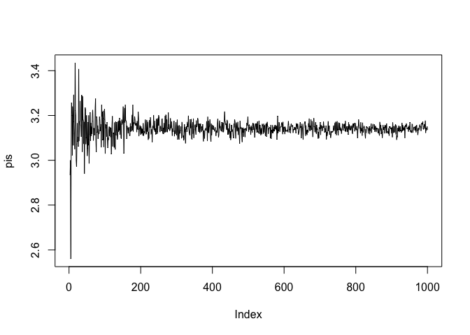<!-- -->

``` r
hist(pis,nclas=100)
```

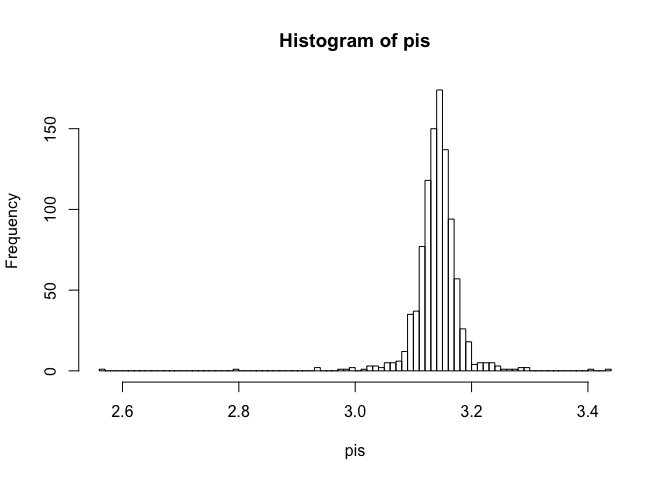<!-- -->

``` r
mean(pis)
```

    ## [1] NA

#### Взяв iris data.frame, для первых двух колонок получить список содержащий матрицы для каждого ряда со значениями строки и суммы колоник без учета данных строки

iris\[1\]

``` r
l=list()
for (i in 1:length(iris[,1]))
  {
   v=c(iris[i,1],sum(iris[,1])-iris[i,1],iris[i,2],sum(iris[,2])-iris[i,2])
   dim(v)=c(2,2)
   l2=list(v)
   l=c(l,l2)
  }
l
```

    ## [[1]]
    ##       [,1]  [,2]
    ## [1,]   5.1   3.5
    ## [2,] 871.4 455.1
    ## 
    ## [[2]]
    ##       [,1]  [,2]
    ## [1,]   4.9   3.0
    ## [2,] 871.6 455.6
    ## 
    ## [[3]]
    ##       [,1]  [,2]
    ## [1,]   4.7   3.2
    ## [2,] 871.8 455.4
    ## 
    ## [[4]]
    ##       [,1]  [,2]
    ## [1,]   4.6   3.1
    ## [2,] 871.9 455.5
    ## 
    ## [[5]]
    ##       [,1]  [,2]
    ## [1,]   5.0   3.6
    ## [2,] 871.5 455.0
    ## 
    ## [[6]]
    ##       [,1]  [,2]
    ## [1,]   5.4   3.9
    ## [2,] 871.1 454.7
    ## 
    ## [[7]]
    ##       [,1]  [,2]
    ## [1,]   4.6   3.4
    ## [2,] 871.9 455.2
    ## 
    ## [[8]]
    ##       [,1]  [,2]
    ## [1,]   5.0   3.4
    ## [2,] 871.5 455.2
    ## 
    ## [[9]]
    ##       [,1]  [,2]
    ## [1,]   4.4   2.9
    ## [2,] 872.1 455.7
    ## 
    ## [[10]]
    ##       [,1]  [,2]
    ## [1,]   4.9   3.1
    ## [2,] 871.6 455.5
    ## 
    ## [[11]]
    ##       [,1]  [,2]
    ## [1,]   5.4   3.7
    ## [2,] 871.1 454.9
    ## 
    ## [[12]]
    ##       [,1]  [,2]
    ## [1,]   4.8   3.4
    ## [2,] 871.7 455.2
    ## 
    ## [[13]]
    ##       [,1]  [,2]
    ## [1,]   4.8   3.0
    ## [2,] 871.7 455.6
    ## 
    ## [[14]]
    ##       [,1]  [,2]
    ## [1,]   4.3   3.0
    ## [2,] 872.2 455.6
    ## 
    ## [[15]]
    ##       [,1]  [,2]
    ## [1,]   5.8   4.0
    ## [2,] 870.7 454.6
    ## 
    ## [[16]]
    ##       [,1]  [,2]
    ## [1,]   5.7   4.4
    ## [2,] 870.8 454.2
    ## 
    ## [[17]]
    ##       [,1]  [,2]
    ## [1,]   5.4   3.9
    ## [2,] 871.1 454.7
    ## 
    ## [[18]]
    ##       [,1]  [,2]
    ## [1,]   5.1   3.5
    ## [2,] 871.4 455.1
    ## 
    ## [[19]]
    ##       [,1]  [,2]
    ## [1,]   5.7   3.8
    ## [2,] 870.8 454.8
    ## 
    ## [[20]]
    ##       [,1]  [,2]
    ## [1,]   5.1   3.8
    ## [2,] 871.4 454.8
    ## 
    ## [[21]]
    ##       [,1]  [,2]
    ## [1,]   5.4   3.4
    ## [2,] 871.1 455.2
    ## 
    ## [[22]]
    ##       [,1]  [,2]
    ## [1,]   5.1   3.7
    ## [2,] 871.4 454.9
    ## 
    ## [[23]]
    ##       [,1]  [,2]
    ## [1,]   4.6   3.6
    ## [2,] 871.9 455.0
    ## 
    ## [[24]]
    ##       [,1]  [,2]
    ## [1,]   5.1   3.3
    ## [2,] 871.4 455.3
    ## 
    ## [[25]]
    ##       [,1]  [,2]
    ## [1,]   4.8   3.4
    ## [2,] 871.7 455.2
    ## 
    ## [[26]]
    ##       [,1]  [,2]
    ## [1,]   5.0   3.0
    ## [2,] 871.5 455.6
    ## 
    ## [[27]]
    ##       [,1]  [,2]
    ## [1,]   5.0   3.4
    ## [2,] 871.5 455.2
    ## 
    ## [[28]]
    ##       [,1]  [,2]
    ## [1,]   5.2   3.5
    ## [2,] 871.3 455.1
    ## 
    ## [[29]]
    ##       [,1]  [,2]
    ## [1,]   5.2   3.4
    ## [2,] 871.3 455.2
    ## 
    ## [[30]]
    ##       [,1]  [,2]
    ## [1,]   4.7   3.2
    ## [2,] 871.8 455.4
    ## 
    ## [[31]]
    ##       [,1]  [,2]
    ## [1,]   4.8   3.1
    ## [2,] 871.7 455.5
    ## 
    ## [[32]]
    ##       [,1]  [,2]
    ## [1,]   5.4   3.4
    ## [2,] 871.1 455.2
    ## 
    ## [[33]]
    ##       [,1]  [,2]
    ## [1,]   5.2   4.1
    ## [2,] 871.3 454.5
    ## 
    ## [[34]]
    ##       [,1]  [,2]
    ## [1,]   5.5   4.2
    ## [2,] 871.0 454.4
    ## 
    ## [[35]]
    ##       [,1]  [,2]
    ## [1,]   4.9   3.1
    ## [2,] 871.6 455.5
    ## 
    ## [[36]]
    ##       [,1]  [,2]
    ## [1,]   5.0   3.2
    ## [2,] 871.5 455.4
    ## 
    ## [[37]]
    ##       [,1]  [,2]
    ## [1,]   5.5   3.5
    ## [2,] 871.0 455.1
    ## 
    ## [[38]]
    ##       [,1]  [,2]
    ## [1,]   4.9   3.6
    ## [2,] 871.6 455.0
    ## 
    ## [[39]]
    ##       [,1]  [,2]
    ## [1,]   4.4   3.0
    ## [2,] 872.1 455.6
    ## 
    ## [[40]]
    ##       [,1]  [,2]
    ## [1,]   5.1   3.4
    ## [2,] 871.4 455.2
    ## 
    ## [[41]]
    ##       [,1]  [,2]
    ## [1,]   5.0   3.5
    ## [2,] 871.5 455.1
    ## 
    ## [[42]]
    ##       [,1]  [,2]
    ## [1,]   4.5   2.3
    ## [2,] 872.0 456.3
    ## 
    ## [[43]]
    ##       [,1]  [,2]
    ## [1,]   4.4   3.2
    ## [2,] 872.1 455.4
    ## 
    ## [[44]]
    ##       [,1]  [,2]
    ## [1,]   5.0   3.5
    ## [2,] 871.5 455.1
    ## 
    ## [[45]]
    ##       [,1]  [,2]
    ## [1,]   5.1   3.8
    ## [2,] 871.4 454.8
    ## 
    ## [[46]]
    ##       [,1]  [,2]
    ## [1,]   4.8   3.0
    ## [2,] 871.7 455.6
    ## 
    ## [[47]]
    ##       [,1]  [,2]
    ## [1,]   5.1   3.8
    ## [2,] 871.4 454.8
    ## 
    ## [[48]]
    ##       [,1]  [,2]
    ## [1,]   4.6   3.2
    ## [2,] 871.9 455.4
    ## 
    ## [[49]]
    ##       [,1]  [,2]
    ## [1,]   5.3   3.7
    ## [2,] 871.2 454.9
    ## 
    ## [[50]]
    ##       [,1]  [,2]
    ## [1,]   5.0   3.3
    ## [2,] 871.5 455.3
    ## 
    ## [[51]]
    ##       [,1]  [,2]
    ## [1,]   7.0   3.2
    ## [2,] 869.5 455.4
    ## 
    ## [[52]]
    ##       [,1]  [,2]
    ## [1,]   6.4   3.2
    ## [2,] 870.1 455.4
    ## 
    ## [[53]]
    ##       [,1]  [,2]
    ## [1,]   6.9   3.1
    ## [2,] 869.6 455.5
    ## 
    ## [[54]]
    ##       [,1]  [,2]
    ## [1,]   5.5   2.3
    ## [2,] 871.0 456.3
    ## 
    ## [[55]]
    ##       [,1]  [,2]
    ## [1,]   6.5   2.8
    ## [2,] 870.0 455.8
    ## 
    ## [[56]]
    ##       [,1]  [,2]
    ## [1,]   5.7   2.8
    ## [2,] 870.8 455.8
    ## 
    ## [[57]]
    ##       [,1]  [,2]
    ## [1,]   6.3   3.3
    ## [2,] 870.2 455.3
    ## 
    ## [[58]]
    ##       [,1]  [,2]
    ## [1,]   4.9   2.4
    ## [2,] 871.6 456.2
    ## 
    ## [[59]]
    ##       [,1]  [,2]
    ## [1,]   6.6   2.9
    ## [2,] 869.9 455.7
    ## 
    ## [[60]]
    ##       [,1]  [,2]
    ## [1,]   5.2   2.7
    ## [2,] 871.3 455.9
    ## 
    ## [[61]]
    ##       [,1]  [,2]
    ## [1,]   5.0   2.0
    ## [2,] 871.5 456.6
    ## 
    ## [[62]]
    ##       [,1]  [,2]
    ## [1,]   5.9   3.0
    ## [2,] 870.6 455.6
    ## 
    ## [[63]]
    ##       [,1]  [,2]
    ## [1,]   6.0   2.2
    ## [2,] 870.5 456.4
    ## 
    ## [[64]]
    ##       [,1]  [,2]
    ## [1,]   6.1   2.9
    ## [2,] 870.4 455.7
    ## 
    ## [[65]]
    ##       [,1]  [,2]
    ## [1,]   5.6   2.9
    ## [2,] 870.9 455.7
    ## 
    ## [[66]]
    ##       [,1]  [,2]
    ## [1,]   6.7   3.1
    ## [2,] 869.8 455.5
    ## 
    ## [[67]]
    ##       [,1]  [,2]
    ## [1,]   5.6   3.0
    ## [2,] 870.9 455.6
    ## 
    ## [[68]]
    ##       [,1]  [,2]
    ## [1,]   5.8   2.7
    ## [2,] 870.7 455.9
    ## 
    ## [[69]]
    ##       [,1]  [,2]
    ## [1,]   6.2   2.2
    ## [2,] 870.3 456.4
    ## 
    ## [[70]]
    ##       [,1]  [,2]
    ## [1,]   5.6   2.5
    ## [2,] 870.9 456.1
    ## 
    ## [[71]]
    ##       [,1]  [,2]
    ## [1,]   5.9   3.2
    ## [2,] 870.6 455.4
    ## 
    ## [[72]]
    ##       [,1]  [,2]
    ## [1,]   6.1   2.8
    ## [2,] 870.4 455.8
    ## 
    ## [[73]]
    ##       [,1]  [,2]
    ## [1,]   6.3   2.5
    ## [2,] 870.2 456.1
    ## 
    ## [[74]]
    ##       [,1]  [,2]
    ## [1,]   6.1   2.8
    ## [2,] 870.4 455.8
    ## 
    ## [[75]]
    ##       [,1]  [,2]
    ## [1,]   6.4   2.9
    ## [2,] 870.1 455.7
    ## 
    ## [[76]]
    ##       [,1]  [,2]
    ## [1,]   6.6   3.0
    ## [2,] 869.9 455.6
    ## 
    ## [[77]]
    ##       [,1]  [,2]
    ## [1,]   6.8   2.8
    ## [2,] 869.7 455.8
    ## 
    ## [[78]]
    ##       [,1]  [,2]
    ## [1,]   6.7   3.0
    ## [2,] 869.8 455.6
    ## 
    ## [[79]]
    ##       [,1]  [,2]
    ## [1,]   6.0   2.9
    ## [2,] 870.5 455.7
    ## 
    ## [[80]]
    ##       [,1]  [,2]
    ## [1,]   5.7   2.6
    ## [2,] 870.8 456.0
    ## 
    ## [[81]]
    ##       [,1]  [,2]
    ## [1,]   5.5   2.4
    ## [2,] 871.0 456.2
    ## 
    ## [[82]]
    ##       [,1]  [,2]
    ## [1,]   5.5   2.4
    ## [2,] 871.0 456.2
    ## 
    ## [[83]]
    ##       [,1]  [,2]
    ## [1,]   5.8   2.7
    ## [2,] 870.7 455.9
    ## 
    ## [[84]]
    ##       [,1]  [,2]
    ## [1,]   6.0   2.7
    ## [2,] 870.5 455.9
    ## 
    ## [[85]]
    ##       [,1]  [,2]
    ## [1,]   5.4   3.0
    ## [2,] 871.1 455.6
    ## 
    ## [[86]]
    ##       [,1]  [,2]
    ## [1,]   6.0   3.4
    ## [2,] 870.5 455.2
    ## 
    ## [[87]]
    ##       [,1]  [,2]
    ## [1,]   6.7   3.1
    ## [2,] 869.8 455.5
    ## 
    ## [[88]]
    ##       [,1]  [,2]
    ## [1,]   6.3   2.3
    ## [2,] 870.2 456.3
    ## 
    ## [[89]]
    ##       [,1]  [,2]
    ## [1,]   5.6   3.0
    ## [2,] 870.9 455.6
    ## 
    ## [[90]]
    ##       [,1]  [,2]
    ## [1,]   5.5   2.5
    ## [2,] 871.0 456.1
    ## 
    ## [[91]]
    ##       [,1]  [,2]
    ## [1,]   5.5   2.6
    ## [2,] 871.0 456.0
    ## 
    ## [[92]]
    ##       [,1]  [,2]
    ## [1,]   6.1   3.0
    ## [2,] 870.4 455.6
    ## 
    ## [[93]]
    ##       [,1]  [,2]
    ## [1,]   5.8   2.6
    ## [2,] 870.7 456.0
    ## 
    ## [[94]]
    ##       [,1]  [,2]
    ## [1,]   5.0   2.3
    ## [2,] 871.5 456.3
    ## 
    ## [[95]]
    ##       [,1]  [,2]
    ## [1,]   5.6   2.7
    ## [2,] 870.9 455.9
    ## 
    ## [[96]]
    ##       [,1]  [,2]
    ## [1,]   5.7   3.0
    ## [2,] 870.8 455.6
    ## 
    ## [[97]]
    ##       [,1]  [,2]
    ## [1,]   5.7   2.9
    ## [2,] 870.8 455.7
    ## 
    ## [[98]]
    ##       [,1]  [,2]
    ## [1,]   6.2   2.9
    ## [2,] 870.3 455.7
    ## 
    ## [[99]]
    ##       [,1]  [,2]
    ## [1,]   5.1   2.5
    ## [2,] 871.4 456.1
    ## 
    ## [[100]]
    ##       [,1]  [,2]
    ## [1,]   5.7   2.8
    ## [2,] 870.8 455.8
    ## 
    ## [[101]]
    ##       [,1]  [,2]
    ## [1,]   6.3   3.3
    ## [2,] 870.2 455.3
    ## 
    ## [[102]]
    ##       [,1]  [,2]
    ## [1,]   5.8   2.7
    ## [2,] 870.7 455.9
    ## 
    ## [[103]]
    ##       [,1]  [,2]
    ## [1,]   7.1   3.0
    ## [2,] 869.4 455.6
    ## 
    ## [[104]]
    ##       [,1]  [,2]
    ## [1,]   6.3   2.9
    ## [2,] 870.2 455.7
    ## 
    ## [[105]]
    ##       [,1]  [,2]
    ## [1,]   6.5   3.0
    ## [2,] 870.0 455.6
    ## 
    ## [[106]]
    ##       [,1]  [,2]
    ## [1,]   7.6   3.0
    ## [2,] 868.9 455.6
    ## 
    ## [[107]]
    ##       [,1]  [,2]
    ## [1,]   4.9   2.5
    ## [2,] 871.6 456.1
    ## 
    ## [[108]]
    ##       [,1]  [,2]
    ## [1,]   7.3   2.9
    ## [2,] 869.2 455.7
    ## 
    ## [[109]]
    ##       [,1]  [,2]
    ## [1,]   6.7   2.5
    ## [2,] 869.8 456.1
    ## 
    ## [[110]]
    ##       [,1]  [,2]
    ## [1,]   7.2   3.6
    ## [2,] 869.3 455.0
    ## 
    ## [[111]]
    ##       [,1]  [,2]
    ## [1,]   6.5   3.2
    ## [2,] 870.0 455.4
    ## 
    ## [[112]]
    ##       [,1]  [,2]
    ## [1,]   6.4   2.7
    ## [2,] 870.1 455.9
    ## 
    ## [[113]]
    ##       [,1]  [,2]
    ## [1,]   6.8   3.0
    ## [2,] 869.7 455.6
    ## 
    ## [[114]]
    ##       [,1]  [,2]
    ## [1,]   5.7   2.5
    ## [2,] 870.8 456.1
    ## 
    ## [[115]]
    ##       [,1]  [,2]
    ## [1,]   5.8   2.8
    ## [2,] 870.7 455.8
    ## 
    ## [[116]]
    ##       [,1]  [,2]
    ## [1,]   6.4   3.2
    ## [2,] 870.1 455.4
    ## 
    ## [[117]]
    ##       [,1]  [,2]
    ## [1,]   6.5   3.0
    ## [2,] 870.0 455.6
    ## 
    ## [[118]]
    ##       [,1]  [,2]
    ## [1,]   7.7   3.8
    ## [2,] 868.8 454.8
    ## 
    ## [[119]]
    ##       [,1]  [,2]
    ## [1,]   7.7   2.6
    ## [2,] 868.8 456.0
    ## 
    ## [[120]]
    ##       [,1]  [,2]
    ## [1,]   6.0   2.2
    ## [2,] 870.5 456.4
    ## 
    ## [[121]]
    ##       [,1]  [,2]
    ## [1,]   6.9   3.2
    ## [2,] 869.6 455.4
    ## 
    ## [[122]]
    ##       [,1]  [,2]
    ## [1,]   5.6   2.8
    ## [2,] 870.9 455.8
    ## 
    ## [[123]]
    ##       [,1]  [,2]
    ## [1,]   7.7   2.8
    ## [2,] 868.8 455.8
    ## 
    ## [[124]]
    ##       [,1]  [,2]
    ## [1,]   6.3   2.7
    ## [2,] 870.2 455.9
    ## 
    ## [[125]]
    ##       [,1]  [,2]
    ## [1,]   6.7   3.3
    ## [2,] 869.8 455.3
    ## 
    ## [[126]]
    ##       [,1]  [,2]
    ## [1,]   7.2   3.2
    ## [2,] 869.3 455.4
    ## 
    ## [[127]]
    ##       [,1]  [,2]
    ## [1,]   6.2   2.8
    ## [2,] 870.3 455.8
    ## 
    ## [[128]]
    ##       [,1]  [,2]
    ## [1,]   6.1   3.0
    ## [2,] 870.4 455.6
    ## 
    ## [[129]]
    ##       [,1]  [,2]
    ## [1,]   6.4   2.8
    ## [2,] 870.1 455.8
    ## 
    ## [[130]]
    ##       [,1]  [,2]
    ## [1,]   7.2   3.0
    ## [2,] 869.3 455.6
    ## 
    ## [[131]]
    ##       [,1]  [,2]
    ## [1,]   7.4   2.8
    ## [2,] 869.1 455.8
    ## 
    ## [[132]]
    ##       [,1]  [,2]
    ## [1,]   7.9   3.8
    ## [2,] 868.6 454.8
    ## 
    ## [[133]]
    ##       [,1]  [,2]
    ## [1,]   6.4   2.8
    ## [2,] 870.1 455.8
    ## 
    ## [[134]]
    ##       [,1]  [,2]
    ## [1,]   6.3   2.8
    ## [2,] 870.2 455.8
    ## 
    ## [[135]]
    ##       [,1]  [,2]
    ## [1,]   6.1   2.6
    ## [2,] 870.4 456.0
    ## 
    ## [[136]]
    ##       [,1]  [,2]
    ## [1,]   7.7   3.0
    ## [2,] 868.8 455.6
    ## 
    ## [[137]]
    ##       [,1]  [,2]
    ## [1,]   6.3   3.4
    ## [2,] 870.2 455.2
    ## 
    ## [[138]]
    ##       [,1]  [,2]
    ## [1,]   6.4   3.1
    ## [2,] 870.1 455.5
    ## 
    ## [[139]]
    ##       [,1]  [,2]
    ## [1,]   6.0   3.0
    ## [2,] 870.5 455.6
    ## 
    ## [[140]]
    ##       [,1]  [,2]
    ## [1,]   6.9   3.1
    ## [2,] 869.6 455.5
    ## 
    ## [[141]]
    ##       [,1]  [,2]
    ## [1,]   6.7   3.1
    ## [2,] 869.8 455.5
    ## 
    ## [[142]]
    ##       [,1]  [,2]
    ## [1,]   6.9   3.1
    ## [2,] 869.6 455.5
    ## 
    ## [[143]]
    ##       [,1]  [,2]
    ## [1,]   5.8   2.7
    ## [2,] 870.7 455.9
    ## 
    ## [[144]]
    ##       [,1]  [,2]
    ## [1,]   6.8   3.2
    ## [2,] 869.7 455.4
    ## 
    ## [[145]]
    ##       [,1]  [,2]
    ## [1,]   6.7   3.3
    ## [2,] 869.8 455.3
    ## 
    ## [[146]]
    ##       [,1]  [,2]
    ## [1,]   6.7   3.0
    ## [2,] 869.8 455.6
    ## 
    ## [[147]]
    ##       [,1]  [,2]
    ## [1,]   6.3   2.5
    ## [2,] 870.2 456.1
    ## 
    ## [[148]]
    ##       [,1]  [,2]
    ## [1,]   6.5   3.0
    ## [2,] 870.0 455.6
    ## 
    ## [[149]]
    ##       [,1]  [,2]
    ## [1,]   6.2   3.4
    ## [2,] 870.3 455.2
    ## 
    ## [[150]]
    ##       [,1]  [,2]
    ## [1,]   5.9   3.0
    ## [2,] 870.6 455.6

#### Функция Apply

apply (data.frame(), 1 or 2, FUNCTION) 1 - by row 2 - by column

lapply(list, FUNCTION) - output is list sapply(list, FUNCTION) - output is vector tapply(vector,factor, FUN) - finds all data dedicated to one factor and applys function to it

``` r
apply(iris[,1:4],2,sum)
```

    ## Sepal.Length  Sepal.Width Petal.Length  Petal.Width 
    ##        876.5        458.6        563.7        179.9

``` r
tapply(iris$Sepal.Length, iris$Species, sum)
```

    ##     setosa versicolor  virginica 
    ##      250.3      296.8      329.4

#### Базовая графика - функция plot(x,y)

``` r
x=c(2,8,6)
y=c(3,7,9)
plot(5:10)
```

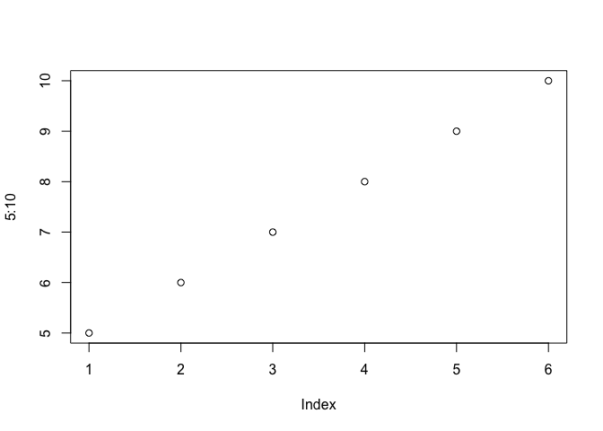<!-- -->

``` r
plot(x,y)
```

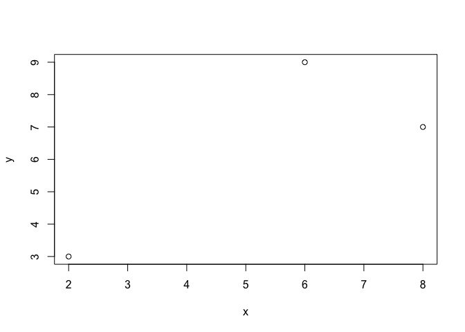<!-- -->

``` r
plot(x,y, type="l")
```

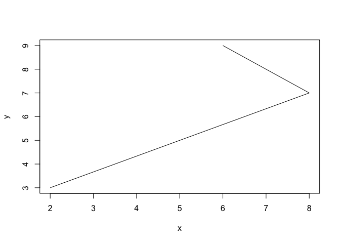<!-- -->

``` r
plot(x,y, type="b")
```

<!-- -->

``` r
plot(x,y,type="h")
```

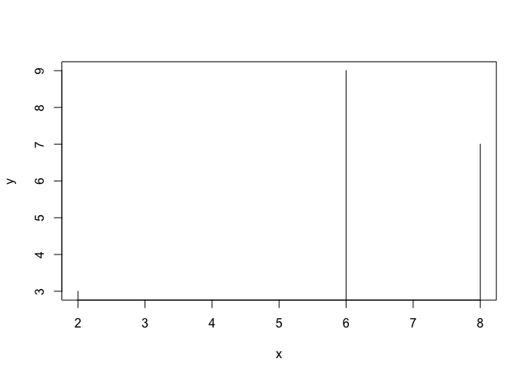<!-- -->

``` r
plot(x,y,type="s", col=rgb(.90,.10,.10,.9))
```

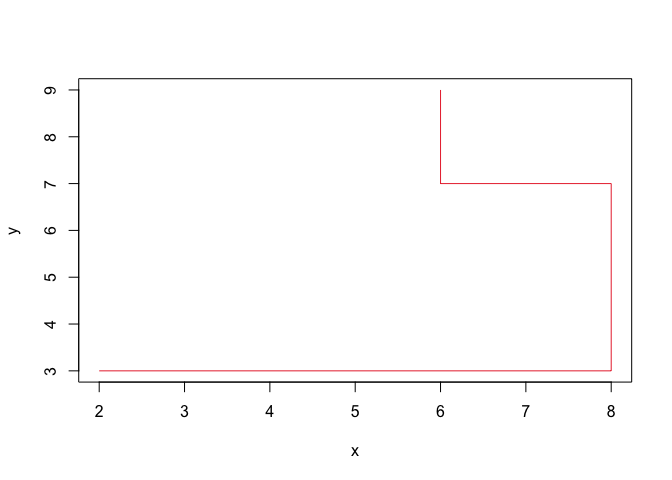<!-- -->

``` r
plot(seq(-10,10,.01),sin(seq(-10,10,.01)), type="h")
```

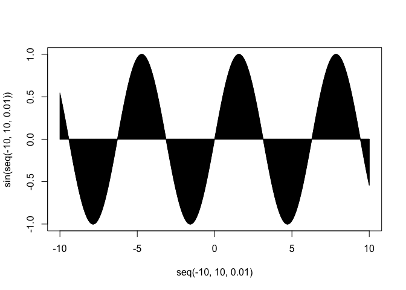<!-- -->

``` r
plot(seq(-10,10,.01), sin(seq(-10,10,.01)), col=rgb(.90,.10,.10,.9), type="h", xlim=c(-20,20), ylim=c(-5,5))
```

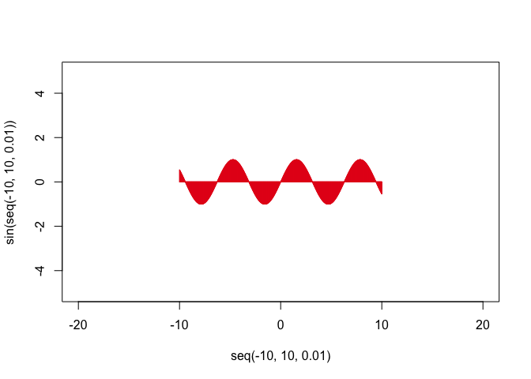<!-- -->

``` r
plot(seq(-10,10,.01),sin(seq(-10,10,.01)), col=rgb(.90,.10,.10,.9), type="h", xlim=c(-20,20), ylim=c(-5,5),main="My first cos(x)",xlab="x",ylab="sin(x)")
```

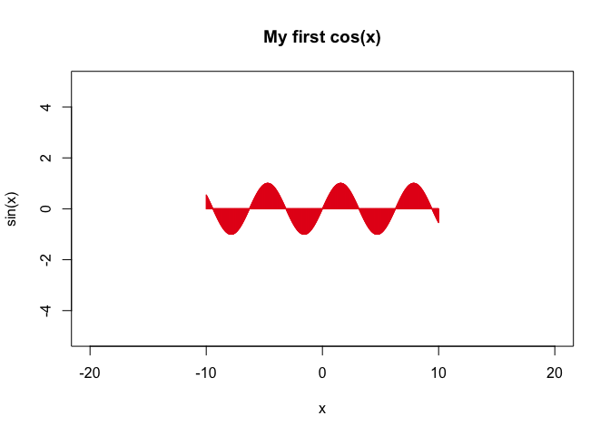<!-- -->

``` r
plot(seq(-10,10,.01),sin(seq(-10,10,.01)), col=rgb(.90,.10,.10,.9), type="l", xlim=c(-20,20), ylim=c(-5,5),main="My first cos(x)",xlab="x",ylab="sin(x)",lwd=.4)
```

<!-- -->

``` r
plot(seq(-10,10,.01),sin(seq(-10,10,.01)), col=rgb(.90,.10,.10,.9), type="l", xlim=c(-20,20), ylim=c(-5,5),main="My first cos(x)",xlab="x",ylab="sin(x)",lwd=4, lty=4)
```

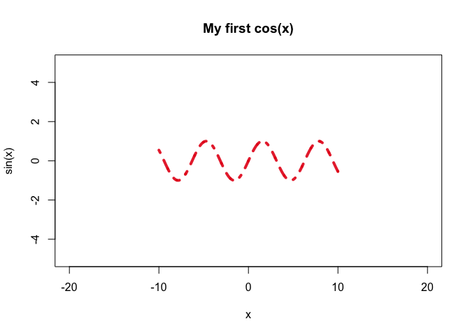<!-- -->

``` r
plot(seq(-10,10,.01),sin(seq(-10,10,.01)), col=rgb(.90,.10,.10,.9), type="b", xlim=c(-20,20), ylim=c(-5,5),main="My first cos(x)",xlab="x",ylab="sin(x)",lwd=4, lty=4, pch=4)
```

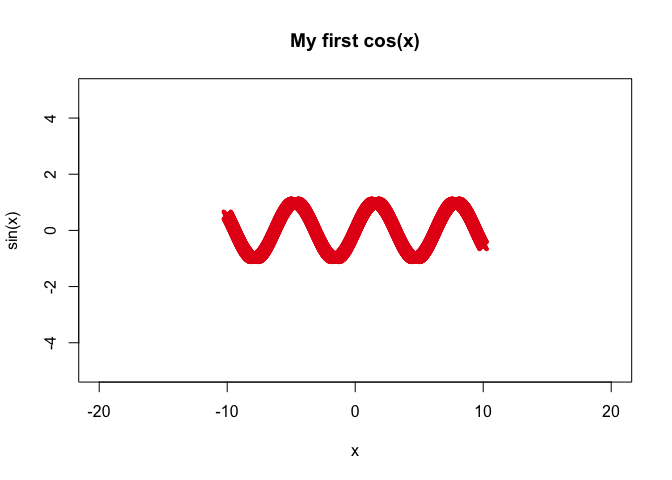<!-- -->

``` r
####Линии

plot(seq(-10,10,.01),sin(seq(-10,10,.01)), type="l")
lines(seq(-10,10,.01),rep(c(0),2001), type="l", col="red")
```

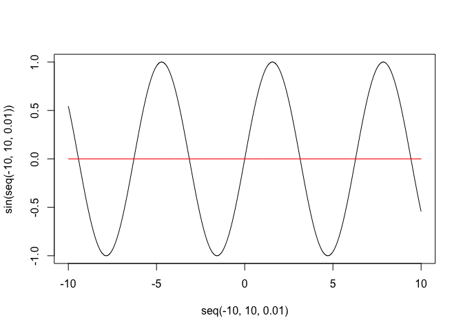<!-- -->

``` r
x=(seq(-10,10,.01))
plot(x, (1-x^2)^.5, type="l",ylim=c(1,-1), xlim=c(-1,1))
lines(x, -((1-x^2)^.5))
lines(rep(c(0),401),seq(-2,2,.01))
lines(seq(-2,2,.01),rep(c(0),401))
```

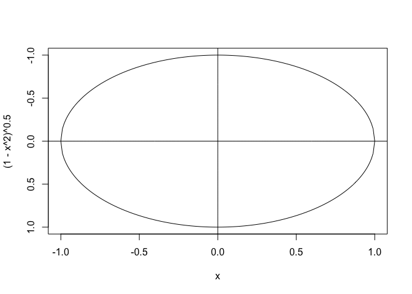<!-- -->

Load the ggplot2 package
========================

``` r
#install.packages("ggplot2")
library(ggplot2)
```

Explore the mtcars data frame with str()
========================================

``` r
str(mtcars)
```

    ## 'data.frame':    32 obs. of  11 variables:
    ##  $ mpg : num  21 21 22.8 21.4 18.7 18.1 14.3 24.4 22.8 19.2 ...
    ##  $ cyl : num  6 6 4 6 8 6 8 4 4 6 ...
    ##  $ disp: num  160 160 108 258 360 ...
    ##  $ hp  : num  110 110 93 110 175 105 245 62 95 123 ...
    ##  $ drat: num  3.9 3.9 3.85 3.08 3.15 2.76 3.21 3.69 3.92 3.92 ...
    ##  $ wt  : num  2.62 2.88 2.32 3.21 3.44 ...
    ##  $ qsec: num  16.5 17 18.6 19.4 17 ...
    ##  $ vs  : num  0 0 1 1 0 1 0 1 1 1 ...
    ##  $ am  : num  1 1 1 0 0 0 0 0 0 0 ...
    ##  $ gear: num  4 4 4 3 3 3 3 4 4 4 ...
    ##  $ carb: num  4 4 1 1 2 1 4 2 2 4 ...

Execute the following command
=============================

``` r
ggplot(mtcars, aes(x = cyl, y = mpg)) +
  geom_point()
```

<!-- -->

Change the command below so that cyl is treated as factor
=========================================================

``` r
ggplot(mtcars, aes(x = factor(cyl), y = mpg)) +
  geom_point()
```

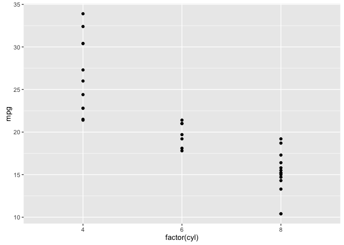<!-- -->

A scatter plot has been made for you
====================================

``` r
ggplot(mtcars, aes(x = wt, y = mpg)) +
  geom_point()
```

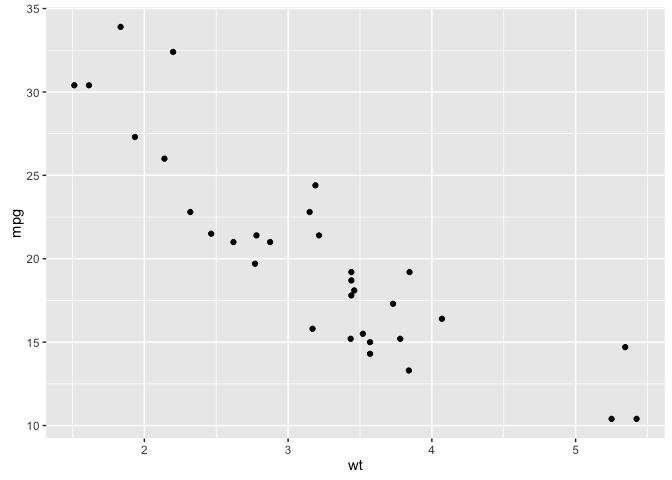<!-- -->

The color should be dependent on the displacement of the car engine, found in disp
==================================================================================

``` r
ggplot(mtcars, aes(x = wt, y = mpg, col = disp)) +
  geom_point()
```

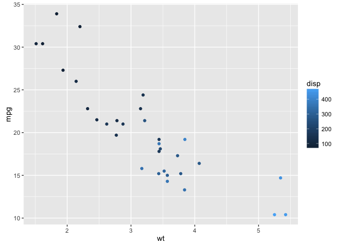<!-- -->

The size should be dependent on the displacement of the car engine, found in
============================================================================

``` r
ggplot(mtcars, aes(x = wt, y = mpg, size = disp)) +
  geom_point()
```

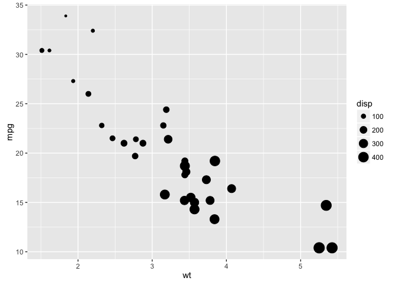<!-- -->

Add geom\_point() and geom\_smooth() with +
===========================================

``` r
ggplot(diamonds, aes(x = carat, y = price)) + geom_point() + geom_smooth()
```

<!-- -->

``` r
# The plot you created in the previous exercise
ggplot(diamonds, aes(x = carat, y = price)) +
  geom_point() +
  geom_smooth()
```

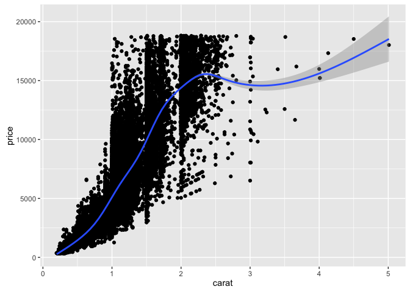<!-- -->

``` r
# Copy the above command but show only the smooth line
ggplot(diamonds, aes(x = carat, y = price)) +  geom_smooth()
```

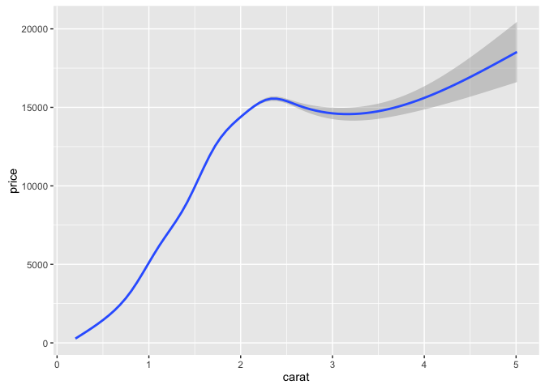<!-- -->

``` r
# Copy the above command and assign the correct value to col in aes()
ggplot(diamonds, aes(x = carat, y = price, col=clarity)) +
  geom_smooth()
```

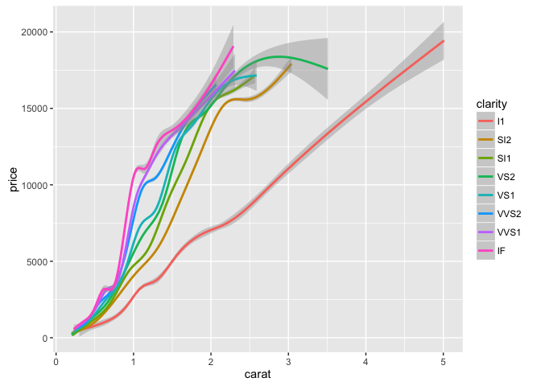<!-- -->

``` r
# Keep the color settings from previous command. Plot only the points with argument alpha.
ggplot(diamonds, aes(x = carat, y = price, col=clarity)) +
  geom_point(alpha = 0.4)
```

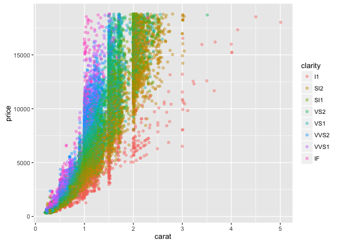<!-- -->

``` r
# Create the object containing the data and aes layers: dia_plot
dia_plot = ggplot(diamonds, aes(x = carat, y = price))

# Add a geom layer with + and geom_point()

dia_plot + geom_point()
```

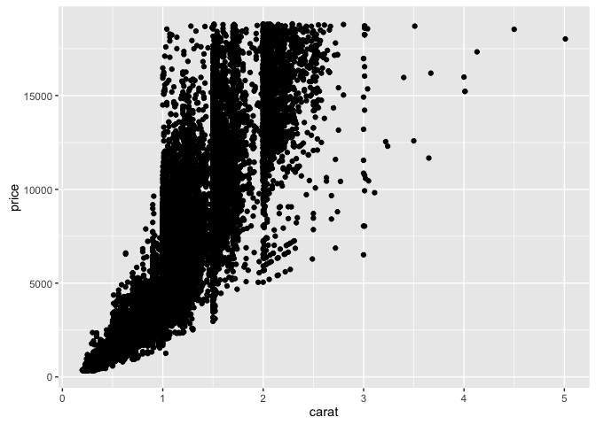<!-- -->

``` r
# Add the same geom layer, but with aes() inside

dia_plot + geom_point(aes(col=clarity))
```

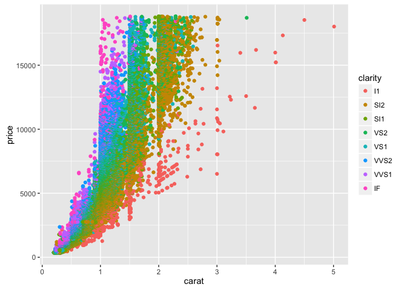<!-- -->
