Семинар 4 - Построение моделей
==============================

Корелляция
----------

Давайте создадим два вектора, ковариацию между которыми мы и попытаемся посчитать

``` r
A=1:3
B=c(3,6,7)
```

Общая идея ковариации состоит в определении степени взаимноизменения двух групп данных, т.е. на сколько часто изменение одной величины буде совпадать со сходным изменением другой величины. В качестве показателя изменения величины мы будем использовать отклонение от среднего. Посчитаем отклонение от среднего для каждого из наших векторов.

``` r
diff_A <- A - mean(A)
diff_B <- B - mean(B)
```

Для определения взаимности изменения величин мы перемножим их отклонения от среднего и просумируем результаты. Очевидно, что ковариация будет тем больше, чем чаще у нас совпадали знаки отклонений от среднего, а значит и их "направление". Так же очевидно, что для того чтобы ковариации выборок разных размеров были сравнимы, мы должны разделить полученную сумму на объем выборки:

``` r
cov <- sum(diff_A*diff_B)/ (length(A)-1)
```

Отдельно для вычисления стандартного отклонения расчитаем квадраты отклонений от среднего для каждого вектора

``` r
sq_diff_A <- diff_A^2
sq_diff_B <- diff_B^2
```

Просуммировав квадраты отклонений, разделив их на объем выборки минус 1 и взяв из полученного квадратный корень, мы получим стандартное отклонение.

``` r
sd_A <- sqrt(sum(sq_diff_A)/(length(A)-1))
sd_B <- sqrt(sum(sq_diff_B)/(length(B)-1))
```

Тогда коэффициентом корреляции двух величин будет называться отношение величины их ковариации к произведению стандартных отклонений каждой из этих величин.

``` r
correlation <- cov/(sd_A*sd_B)
correlation
```

    ## [1] 0.9607689

В правильности наших вычислений можно убедиться воспользовавшись функцией cor() языка R

``` r
cor(A,B)
```

    ## [1] 0.9607689

Стандартная команда по открытию файлов позволяет точно так же открывать и URL Откроем данные по физической стойкости в переменную PE

``` r
PE <- read.table("http://assets.datacamp.com/course/Conway/Lab_Data/Stats1.13.Lab.04.txt", header=TRUE)
```

Воспользуемся функцией describe из пакета psych, которая дает нам более подробную описательную статистику для всех колонок таблицы, чем стандартные средства.

``` r
library("psych")
describe(PE)
```

    ##             vars   n   mean    sd median trimmed   mad min max range skew
    ## pid            1 200 101.81 58.85  101.5  101.71 74.87   1 204   203 0.01
    ## age            2 200  49.41 10.48   48.0   49.46 10.38  20  82    62 0.06
    ## activeyears    3 200  10.68  4.69   11.0   10.57  4.45   0  26    26 0.30
    ## endurance      4 200  26.50 10.84   27.0   26.22 10.38   3  55    52 0.22
    ##             kurtosis   se
    ## pid            -1.21 4.16
    ## age            -0.14 0.74
    ## activeyears     0.46 0.33
    ## endurance      -0.44 0.77

Построим графики взаимной зависимости переменных возраст(age), количество лет в спорте (activeyears) и физическая стокйость(endurance).

``` r
plot(PE$age~PE$activeyears)
```

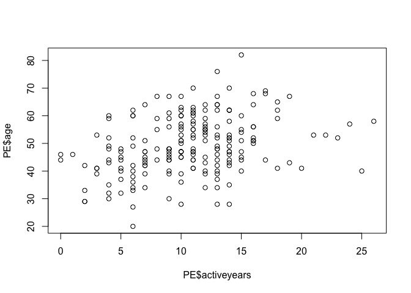<!-- -->

``` r
plot(PE$endurance~PE$activeyears)
```

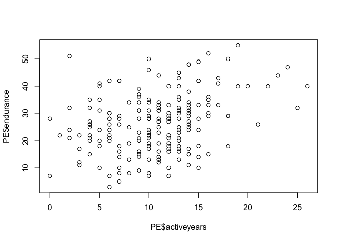<!-- -->

``` r
plot(PE$endurance~PE$age)
```

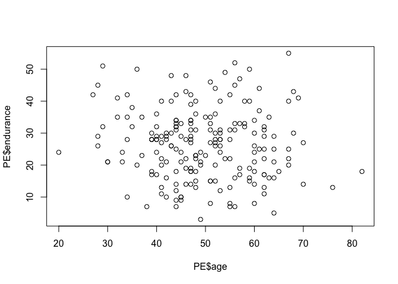<!-- -->

Проведем базовые тесты корреляции для всех переменных

``` r
round(cor(PE[,-1]), 2)  
```

    ##               age activeyears endurance
    ## age          1.00        0.33     -0.08
    ## activeyears  0.33        1.00      0.33
    ## endurance   -0.08        0.33      1.00

Сделаем дополнительные тесты. Если нулевая гипотеза об отсутствии корелляции может быть отвергнута с уровнем значимости в 5%, то связь между переменными значимо отличается от нуля с 95% доверительным интервалом.

``` r
cor.test(PE$age, PE$activeyears)
```

    ## 
    ##  Pearson's product-moment correlation
    ## 
    ## data:  PE$age and PE$activeyears
    ## t = 4.9022, df = 198, p-value = 1.969e-06
    ## alternative hypothesis: true correlation is not equal to 0
    ## 95 percent confidence interval:
    ##  0.1993491 0.4473145
    ## sample estimates:
    ##       cor 
    ## 0.3289909

``` r
cor.test(PE$age, PE$endurance)
```

    ## 
    ##  Pearson's product-moment correlation
    ## 
    ## data:  PE$age and PE$endurance
    ## t = -1.1981, df = 198, p-value = 0.2323
    ## alternative hypothesis: true correlation is not equal to 0
    ## 95 percent confidence interval:
    ##  -0.22097811  0.05454491
    ## sample estimates:
    ##         cor 
    ## -0.08483813

``` r
cor.test(PE$endurance, PE$activeyears)
```

    ## 
    ##  Pearson's product-moment correlation
    ## 
    ## data:  PE$endurance and PE$activeyears
    ## t = 4.8613, df = 198, p-value = 2.37e-06
    ## alternative hypothesis: true correlation is not equal to 0
    ## 95 percent confidence interval:
    ##  0.1967110 0.4451154
    ## sample estimates:
    ##       cor 
    ## 0.3265402

Вы должны быть осторожны с интерпретацией коэффициентов корреляции при анализе нерепрезентативного образцов. В этом упражнении вы узнаете, как разделить набор данных на подмножества и посмотреть, в какой степени это может изменить коэффициенты корреляции.

Загрузим данные по исследванию последствий сотрясение головного мозга, вызвынных связанными со спортом травмами, которое включает в себя данные опроса как контрольной группоы, так и группы спортсменов, которые пострадали от сотрясения.

``` r
impact=read.csv("https://dl.dropboxusercontent.com/s/7ubjig9z5hmv858/impact.csv?dl=0")
describe(impact)
```

    ##            vars  n  mean    sd median trimmed   mad   min   max range
    ## subject       1 40 20.50 11.69  20.50   20.50 14.83  1.00 40.00 39.00
    ## condition*    2 40  1.50  0.51   1.50    1.50  0.74  1.00  2.00  1.00
    ## vermem1       3 40 89.75  6.44  91.00   90.44  6.67 75.00 98.00 23.00
    ## vismem1       4 40 74.88  8.60  75.00   74.97  9.64 59.00 91.00 32.00
    ## vms1          5 40 34.03  3.90  33.50   34.02  3.62 26.29 41.87 15.58
    ## rt1           6 40  0.67  0.15   0.65    0.66  0.13  0.42  1.20  0.78
    ## ic1           7 40  8.28  2.05   8.50    8.38  2.22  2.00 12.00 10.00
    ## sym1          8 40  0.05  0.22   0.00    0.00  0.00  0.00  1.00  1.00
    ## vermem2       9 40 82.00 11.02  85.00   82.97  9.64 59.00 97.00 38.00
    ## vismem2      10 40 71.90  8.42  72.00   72.19 10.38 54.00 86.00 32.00
    ## vms2         11 40 35.83  8.66  35.15   34.98  6.89 20.15 60.77 40.62
    ## rt2          12 40  0.67  0.22   0.65    0.65  0.13  0.19  1.30  1.11
    ## ic2          13 40  6.75  2.98   7.00    6.81  2.97  1.00 12.00 11.00
    ## sym2         14 40 13.88 15.32   7.00   12.38 10.38  0.00 43.00 43.00
    ##             skew kurtosis   se
    ## subject     0.00    -1.29 1.85
    ## condition*  0.00    -2.05 0.08
    ## vermem1    -0.70    -0.51 1.02
    ## vismem1    -0.11    -0.96 1.36
    ## vms1        0.08    -0.75 0.62
    ## rt1         1.14     2.21 0.02
    ## ic1        -0.57     0.36 0.32
    ## sym1        3.98    14.16 0.03
    ## vermem2    -0.65    -0.81 1.74
    ## vismem2    -0.28    -0.87 1.33
    ## vms2        0.86     0.65 1.37
    ## rt2         0.93     1.29 0.03
    ## ic2        -0.16    -1.06 0.47
    ## sym2        0.44    -1.47 2.42

Посчитаем коэффициенты корелляции между коэффициентвми визуальной и вербальной памяти пациентов.

``` r
entirecorr <- round(cor(impact$vismem2,impact$vermem2),2)
```

С помощью команды describeBy из пакета psych посомтрим описательные статистики для переменных данной таблицы, сгруппированные по категориям переменной condition - состояние опрошенных. Т.е. посмотрим описательные статистики для контрольной и целевой группы.

``` r
describeBy(impact, impact$condition)
```

    ## group: concussed
    ##            vars  n  mean    sd median trimmed   mad   min   max range
    ## subject       1 20 30.50  5.92  30.50   30.50  7.41 21.00 40.00 19.00
    ## condition*    2 20  1.00  0.00   1.00    1.00  0.00  1.00  1.00  0.00
    ## vermem1       3 20 89.65  7.17  92.50   90.56  5.93 75.00 97.00 22.00
    ## vismem1       4 20 74.75  8.03  74.00   74.25  8.15 63.00 91.00 28.00
    ## vms1          5 20 33.20  3.62  33.09   33.27  3.32 26.29 39.18 12.89
    ## rt1           6 20  0.66  0.17   0.63    0.64  0.13  0.42  1.20  0.78
    ## ic1           7 20  8.55  1.64   9.00    8.62  1.48  5.00 11.00  6.00
    ## sym1          8 20  0.05  0.22   0.00    0.00  0.00  0.00  1.00  1.00
    ## vermem2       9 20 74.05  9.86  74.00   73.88 11.86 59.00 91.00 32.00
    ## vismem2      10 20 69.20  8.38  69.50   69.62 10.38 54.00 80.00 26.00
    ## vms2         11 20 38.27 10.01  35.15   37.32  7.73 25.70 60.77 35.07
    ## rt2          12 20  0.78  0.23   0.70    0.74  0.11  0.51  1.30  0.79
    ## ic2          13 20  5.00  2.53   5.00    4.88  2.97  1.00 11.00 10.00
    ## sym2         14 20 27.65  9.07  27.00   27.75 11.12 13.00 43.00 30.00
    ##             skew kurtosis   se
    ## subject     0.00    -1.38 1.32
    ## condition*   NaN      NaN 0.00
    ## vermem1    -0.79    -0.70 1.60
    ## vismem1     0.45    -0.72 1.80
    ## vms1       -0.13    -0.78 0.81
    ## rt1         1.38     2.41 0.04
    ## ic1        -0.39    -0.81 0.37
    ## sym1        3.82    13.29 0.05
    ## vermem2     0.07    -1.24 2.21
    ## vismem2    -0.27    -1.26 1.87
    ## vms2        0.77    -0.57 2.24
    ## rt2         1.09    -0.10 0.05
    ## ic2         0.39    -0.28 0.57
    ## sym2       -0.11    -1.25 2.03
    ## -------------------------------------------------------- 
    ## group: control
    ##            vars  n  mean   sd median trimmed  mad   min   max range  skew
    ## subject       1 20 10.50 5.92  10.50   10.50 7.41  1.00 20.00 19.00  0.00
    ## condition*    2 20  2.00 0.00   2.00    2.00 0.00  2.00  2.00  0.00   NaN
    ## vermem1       3 20 89.85 5.82  90.00   90.31 7.41 78.00 98.00 20.00 -0.41
    ## vismem1       4 20 75.00 9.34  77.00   75.50 9.64 59.00 88.00 29.00 -0.46
    ## vms1          5 20 34.86 4.09  34.39   34.85 4.92 27.36 41.87 14.51  0.09
    ## rt1           6 20  0.67 0.13   0.66    0.67 0.13  0.42  1.00  0.58  0.47
    ## ic1           7 20  8.00 2.41   7.50    8.12 2.22  2.00 12.00 10.00 -0.41
    ## sym1          8 20  0.05 0.22   0.00    0.00 0.00  0.00  1.00  1.00  3.82
    ## vermem2       9 20 89.95 4.36  90.50   90.06 5.19 81.00 97.00 16.00 -0.25
    ## vismem2      10 20 74.60 7.76  74.50   75.00 8.15 60.00 86.00 26.00 -0.23
    ## vms2         11 20 33.40 6.44  34.54   33.52 6.30 20.15 44.28 24.13 -0.25
    ## rt2          12 20  0.57 0.16   0.56    0.57 0.13  0.19  0.90  0.71 -0.16
    ## ic2          13 20  8.50 2.31   9.00    8.69 1.48  3.00 12.00  9.00 -0.73
    ## sym2         14 20  0.10 0.31   0.00    0.00 0.00  0.00  1.00  1.00  2.47
    ##            kurtosis   se
    ## subject       -1.38 1.32
    ## condition*      NaN 0.00
    ## vermem1       -0.87 1.30
    ## vismem1       -1.27 2.09
    ## vms1          -1.19 0.91
    ## rt1           -0.02 0.03
    ## ic1           -0.17 0.54
    ## sym1          13.29 0.05
    ## vermem2       -1.02 0.97
    ## vismem2       -1.11 1.73
    ## vms2          -0.77 1.44
    ## rt2            0.06 0.04
    ## ic2           -0.32 0.52
    ## sym2           4.32 0.07

Сделаем 2 подвыборки: контроль(control) и контуженные(concussed)

``` r
control <- subset(impact, condition=="control")
concussed <- subset(impact, condition=="concussed")
```

Посчитаем коэффициенты коррелляции для каждой подвыборки.

``` r
controlcorr <- round(cor(control$vismem2,control$vermem2),2)
concussedcorr <- round(cor(concussed$vismem2,concussed$vermem2),2)
```

Выведем все значения коэффициентов корелляции одновременно

``` r
correlations <- cbind(entirecorr, controlcorr, concussedcorr)
correlations
```

    ##      entirecorr controlcorr concussedcorr
    ## [1,]       0.45        0.37          0.35

Линейная регрессия. Теория
--------------------------

В качестве примера рассмотрим систолическое кровяное давление у людей (выражается в мм ртутного столба). Очевидно, что уровень кровяного давления не может быть одинаковым у всех людей – при обследовании случайно сформированной выборки мы почти всегда будем наблюдать определенный разброс значений этой переменной, хотя некоторые значения будут встречаться чаше других. Сформируем выборку возможного распределения 100 значений давления крови, (не будем пока уточнять механизм получения данных и предположим, что это – реальные измерения у реальных случайно отобранных людей, различающихся по возрасту, полу, массе тела и, возможно, каким-то другим характеристикам):

``` r
y <- c( 109.14, 117.55, 106.76, 115.26, 117.13, 125.39, 121.03, 114.03, 124.83, 113.92, 122.04, 109.41, 131.61, 103.93, 116.64, 117.06, 111.73, 120.41, 112.98, 101.20, 120.19, 128.53, 120.14, 108.70, 130.77, 110.16, 129.07, 123.46, 130.02, 130.31, 135.06, 129.17, 137.08, 107.62, 139.77, 121.47, 130.95, 138.15, 114.31, 134.58, 135.86, 138.49, 110.01, 127.80, 122.57, 136.99, 139.53, 127.34, 132.26, 120.85, 124.99, 133.36, 142.46, 123.58, 145.05, 127.83, 140.42, 149.64, 151.01, 135.69, 138.25, 127.24, 135.55, 142.76, 146.67, 146.33, 137.00, 145.00, 143.98, 143.81, 159.92, 160.97, 157.45, 145.68, 129.98, 137.45, 151.22, 136.10, 150.60, 148.79, 167.93, 160.85, 146.28, 145.97, 135.59, 156.62, 153.12, 165.96, 160.94, 168.87, 167.64, 154.64, 152.46, 149.03, 159.56, 149.31, 153.56, 170.87, 163.52, 150.97)

c(mean(y), sd(y)) # среднее значение и станд. отклонение
```

    ## [1] 135.15730  16.96017

``` r
shapiro.test(y)
```

    ## 
    ##  Shapiro-Wilk normality test
    ## 
    ## data:  y
    ## W = 0.98263, p-value = 0.2121

``` r
library(ggplot2) # графическое изображение распределения данных
```

    ## 
    ## Attaching package: 'ggplot2'

    ## Следующие объекты скрыты от 'package:psych':
    ## 
    ##     %+%, alpha

``` r
ggplot(data = data.frame(y), aes(x = y)) + geom_histogram() +
ylab("Частота") + xlab("Давление, мм рт. ст.")
```

    ## `stat_bin()` using `bins = 30`. Pick better value with `binwidth`.

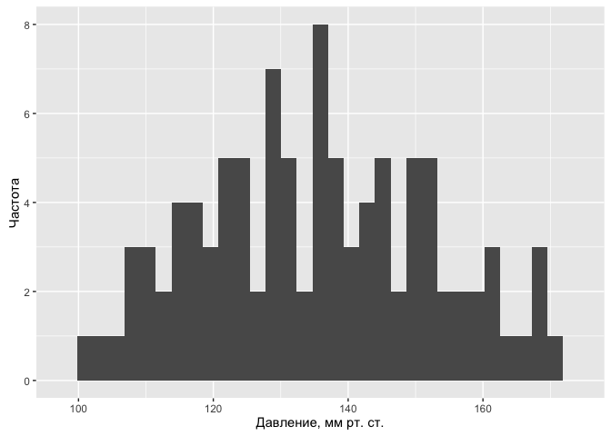<!-- -->

Греческие буквы μ и σ обозначают истинные (также "генеральные") параметры модели, которые, как правило, нам неизвестны. Тем не менее, мы можем оценить значения параметров по соответствующим выборочным статистикам. Так, в случае представленных выше 100 значений систолического кровяного давления выборочные среднее значение и стандартное отклонение составляют 135.16 мм рт. ст. и 16.96 мм рт. ст. соответственно. Допуская, что данные действительно происходят из нормально распределенной генеральной совокупности, мы можем записать нашу модель в виде yi ~ N(135.16, 16.96). Эту модель можно использовать для предсказания давления крови, однако для всех людей предсказанное значение окажется одинаковым и будет равно μ.Обычным способом записи этой модели является следующий: \(y_{i}=135.16+\epsilon_{i}\), где ei – это остатки модели, имеющие нормальное распределение со средним значением 0 и стандартным отклонением 16.96: ei ~ N(0, 16.96). Остатки рассчитываются как разница между реально наблюдаемыми значениями переменной Y и значениями, предсказанными моделью (в рассматриваемом примере ei = yi - 135.16). С другой стороны эта запись представляет собой ни что иное, как линейную регрессионную модель, у которой нет ни одного предиктора, и которую часто называют «нуль-моделью» или «нулевой моделью» (англ. null models).

#### В сущности, статистическая модель – это упрощенное математическое представление процесса, который, как мы полагаем, привел к генерации наблюдаемых значений изучаемой переменной. Это значит, что мы можем использовать модель для симуляции (simulation) – т.е. процедуры, имитирующей моделируемый процесс и позволяющей тем самым искусственно генерировать новые значения изучаемой переменной, которые, как мы надеемся, будут обладать свойствами реальных данных.

Новые данные на основе этой простой модели можно легко сгенерировать в R при помощи функции rnorm():

``` r
set.seed(101) # для воспроизводимости результата
y.new.1 <- rnorm(n = 100, mean = 135.16, sd = 16.96)

set.seed(101)
y.new.2 <- 135.16 + rnorm(n = 100, mean = 0, sd = 16.96)
```

Проверим, идентичны ли оба вектора?

``` r
all(y.new.1 == y.new.2)
```

    ## [1] TRUE

Теперь необходимо вспомнить о том, что параметры нашей нулевой модели являются лишь точечными оценками истинных параметров, и что всегда будет присутствовать неопределенность в отношении того, насколько точны эти точечные выборочные оценки. В приведенных выше командах эта неопределенность не была учтена: при создании векторов y.new.1 и y.new.2 выборочные оценки среднего значения и стандартного отклонения кровяного давления рассматривались как параметры генеральной совокупности. В зависимости от поставленной задачи, такой подход может оказаться достаточным. Однако мы сделаем еще один шаг и постараемся учесть неопределенность в отношении точечных оценок параметров модели. При проведении имитаций воспользуемся функцией lm(), которая предназначена для подгонки линейных регрессионных моделей. Ничего удивительного здесь нет – ведь мы уже знаем, что нашу простую модель кровяного давления можно рассматривать как линейную регрессионную модель, у которой нет ни одного предиктора:

``` r
y.lm <- lm(y ~ 1) # формула для оценки только свободного члена
summary(y.lm)
```

    ## 
    ## Call:
    ## lm(formula = y ~ 1)
    ## 
    ## Residuals:
    ##     Min      1Q  Median      3Q     Max 
    ## -33.957 -13.260   0.413  12.043  35.713 
    ## 
    ## Coefficients:
    ##             Estimate Std. Error t value Pr(>|t|)    
    ## (Intercept)  135.157      1.696   79.69   <2e-16 ***
    ## ---
    ## Signif. codes:  0 '***' 0.001 '**' 0.01 '*' 0.05 '.' 0.1 ' ' 1
    ## 
    ## Residual standard error: 16.96 on 99 degrees of freedom

Как следует из приведенных результатов, свободный член подогнанной модели (Intercept) в точности совпадает со средним значением данных (135.16 мм рт. ст.), а стандартное отклонение остатков модели (Residual standard error) совпадает со стандартным отклонением этих данных (16.96 мм рт. ст.). Важно, однако, что мы при этом вычислили также оценку стандартной ошибки среднего значения, равную 1.696 (см. столбец Std. Error на пересечении со строкой (Intercept)). По определению, стандартная ошибка параметра – это стандартное отклонение \[нормального\] распределения значений этого параметра, рассчитанных по выборкам одинакового размера из той же генеральной совокупности. Мы можем использовать это обстоятельство для учета неопределенности в отношении точечных оценок параметров модели при порождении новых данных. Так, зная выборочные оценки параметров и их стандартные ошибки, мы можем: а) сгенерировать несколько возможных значений этих параметров (т.е. составить несколько реализаций той же модели, варьируя значения параметров) и б) сгенерировать новые данные на основе каждой из этих альтернативных реализаций модели.

``` r
library(arm)
```

    ## Loading required package: MASS

    ## Loading required package: Matrix

    ## Loading required package: lme4

    ## 
    ## arm (Version 1.8-6, built: 2015-7-7)

    ## Working directory is /Volumes/MACFILES/YandexDisk/Yandex.Disk.localized/Jobs/EDDY/Modelling/Modeling course/Lectures

    ## 
    ## Attaching package: 'arm'

    ## Следующие объекты скрыты от 'package:psych':
    ## 
    ##     logit, rescale, sim

``` r
set.seed(102) # для воспроизводимости результата
y.sim <- sim(y.lm, 5)
```

y.sim - объект класса S4, который содержит слоты coef (коэффициенты модели) и sigma (станд. отклонения остатков модели):

``` r
str(y.sim)
```

    ## Formal class 'sim' [package "arm"] with 2 slots
    ##   ..@ coef : num [1:5, 1] 136 134 137 136 137
    ##   .. ..- attr(*, "dimnames")=List of 2
    ##   .. .. ..$ : NULL
    ##   .. .. ..$ : chr "(Intercept)"
    ##   ..@ sigma: num [1:5] 16.8 18.9 17.3 16.7 15

Извлекаем альтернативные реализации среднего из y.sim:

``` r
y.sim@coef
```

    ##      (Intercept)
    ## [1,]    136.4780
    ## [2,]    134.3288
    ## [3,]    136.7079
    ## [4,]    136.0775
    ## [5,]    137.3250

Извлекаем альтернативные реализации ст.отклонений остатков:

``` r
y.sim@sigma
```

    ## [1] 16.82947 18.87039 17.30262 16.74308 15.00630

Конечно, 5 реализаций модели – это совершенно недостаточно, чтобы сделать какие-либо убедительные выводы. Увеличим это число до 1000:

``` r
set.seed(102) # для воспроизводимости результата
y.sim <- sim(y.lm, 1000)
```

Инициализация пустой матрицы, в которой мы будем сохранять данные, сгенерированные на основе 1000 альтернативных реализаций модели:

``` r
y.rep <- array(NA, c(1000, 100))
# Заполняем матрицу y.rep имитированными данными:
for(s in 1:1000){
y.rep[s, ] <- rnorm(100, y.sim@coef[s], y.sim@sigma[s])
}
```

Чтобы лучше понять, что мы только что сделали, изобразим гистограммы выборочных распределений значений кровяного давления, сгенерированных на основе, например, первых 12 реализаций нулевой модели:

``` r
par(mfrow = c(5, 4), mar = c(2, 2, 1, 1))
for(s in 1: 12){ hist(y.rep[s, ], xlab = "", ylab = "",
breaks = 20, main = "")}
```

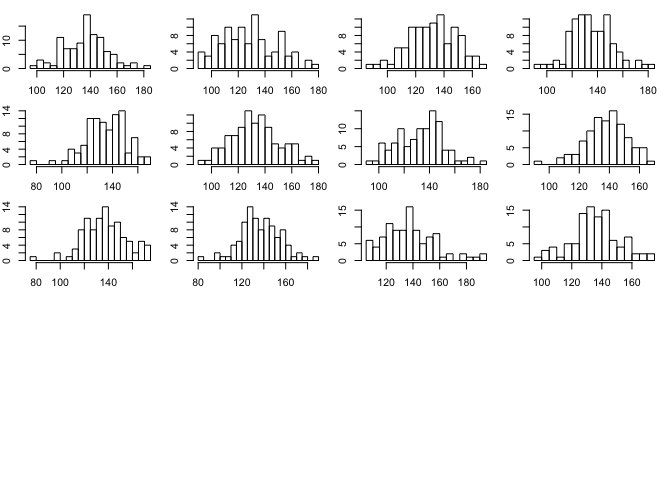<!-- -->

Рассчитаем интерквартильный размах (ИКР) для каждого имитированного набора данных и сравним полученное распределение из 1000 значений с ИКР реальных данных. Для расчета ИКР в R служит функция IQR():

``` r
test.IQR <- apply(y.rep, MARGIN = 1, FUN = IQR)
```

Выведем гистограмму значений ИКР, рассчитанных для каждого из 1000 имитированных распределений кровяного давления. Вертикальной синей линией покажем ИКР для реально наблюдаемых значений кровяного давления:

``` r
hist(test.IQR, xlim = range(IQR(y), test.IQR), main = "ИКР", xlab = "", ylab = "Частота", breaks = 20) 
lines(rep(IQR(y), 2), c(0, 100), col = "blue", lwd = 4)
```

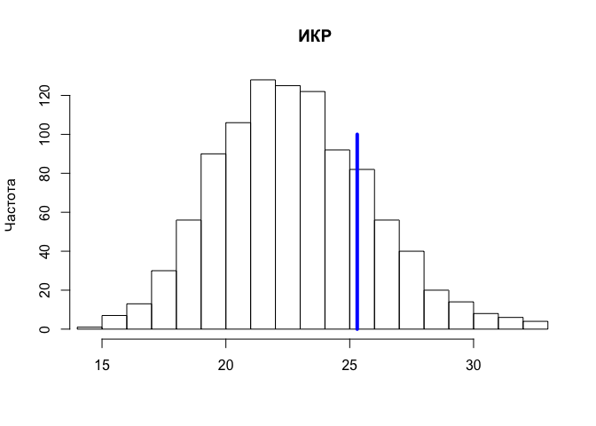<!-- -->

На приведенном рисунке хорошо видно, что значения ИКР для имитированных данных систематически занижены по сравнению с реальными данными. Это свидетельствует о том, что нулевая модель в целом недооценивает уровень вариации реальных значений кровяного давления. Причиной этому может быть то, что мы не учитываем воздействие на кровяное давление каких-либо важных факторов (например, возраст, пол, диета, состояние здоровья, и т.п.). Рассмотрим, как можно расширить нашу нулевую модель, добавив в нее один из таких факторов.

Предположим, что помимо кровяного давления мы также измеряли у каждого испытуемого его/ее возраст (в годах). Покажем графически связь между возрастом и систолическим кровяным давлением. Для визуализации тренда в данных добавим линию регрессии синего цвета:

``` r
# Значения возраста:
x <- rep(seq(16, 65, 1), each = 2)
# Объединяем значения возраста и давления крови в одну таблицу
Data <- data.frame(Age = x, BP = y)
ggplot(data = Data, aes(x = Age, BP)) + geom_point() +
geom_smooth(method = "lm", se = FALSE) +
geom_rug(color = "gray70", sides = "tr") +
ylab("Частота") + xlab("Возраст, лет")
```

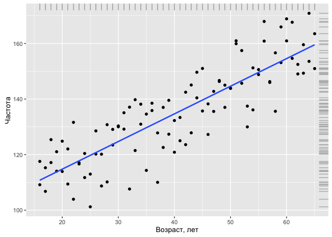<!-- -->

Из графика видно, что между давлением крови и возрастом существует выраженная линейная зависимость: несмотря на определенную вариацию наблюдений, по мере увеличения возраста давление в среднем также возрастает. Мы можем учесть это систематическое изменение среднего кровяного давления, добавив возраст (Age) в нашу нулевую модель: \(y_{i}=N\big(\beta+\beta_{i}\times Age_{i},\sigma\big)\),

``` r
summary(lm(BP ~ Age, data = Data))
```

    ## 
    ## Call:
    ## lm(formula = BP ~ Age, data = Data)
    ## 
    ## Residuals:
    ##      Min       1Q   Median       3Q      Max 
    ## -21.6644  -6.2491   0.0072   6.3101  17.3484 
    ## 
    ## Coefficients:
    ##             Estimate Std. Error t value Pr(>|t|)    
    ## (Intercept) 94.85498    2.66731   35.56   <2e-16 ***
    ## Age          0.99512    0.06204   16.04   <2e-16 ***
    ## ---
    ## Signif. codes:  0 '***' 0.001 '**' 0.01 '*' 0.05 '.' 0.1 ' ' 1
    ## 
    ## Residual standard error: 8.953 on 98 degrees of freedom
    ## Multiple R-squared:  0.7242, Adjusted R-squared:  0.7214 
    ## F-statistic: 257.3 on 1 and 98 DF,  p-value: < 2.2e-16

Согласно полученным результатам, модель кровяного давления можно записать как \(y_{i}=N\big(94.853+0.995\times Age_{i}, 8.953\big)\) или \(y_{i}=94.853+0.995\times Age_{i} + \epsilon_{i}, \epsilon_{i} = N\big(0,8.953\big)\)

Графически эта модель изображена выше на рисунке в виде линии тренда. Обратите внимание: помимо высокой значимости параметров подогнанной модели (р &lt;&lt; 0.001 в обоих случаях), стандартное отклонение остатков составляет 8.853, что почти в 2 раза меньше, чем у нулевой модели (16.96). Это указывает на то, что модель, включающая возраст как предиктор, гораздо лучше описывает вариацию значений кровяного давления у 100 обследованных испытуемых, чем наша исходная модель без параметра.

Это заключение подтверждается тем, что в результате выполнения имитаций, аналогичных описанным выше, значение интерквартильного размаха для исходных данных располагается в центре распределения имитированных значений ИКР, указывая на отсутствие систематических различий между имитированными и наблюдаемыми данными. Код на языке R и полученную гистограмму мы здесь не приводим, рекомендуя проделать вычисления самому читателю.

Теперь настало время раскрыть небольшой секрет: тот факт, что модель, включающая возраст, гораздо лучше описывает исходные данные, неудивителен, поскольку эти наблюдения были... сгенерированы на основе модели \(y_{i}=97.078+0.949\times Age_{i} + \epsilon_{i}, \epsilon_{i} = N\big(0,9.563\big)\) следующим образом:

``` r
set.seed(101)
y <- rnorm(100, mean = 97.078 + 0.949*x, 9.563)
```

Последняя модель, придуманная в целях демонстрации обсуждаемых принципов, была использована в качестве "истинной" (англ. true model) в том смысле, что она описывала генеральную совокупность. Другими словами, мы предположили, что у нас была возможность одномоментно измерить давление у всех существующих людей и полученные данные описывались бы именно этой "истинной" моделью. В реальной ситуации ни структура (систематическая часть + остатки), ни значения параметров истинной модели исследователю, как правило, неизвестны.

Все, чем он располагает – это наборы экспериментальных данных, часто недостаточно репрезентативных и сильно "зашумленных". Имея эти данные и хорошее понимание изучаемого явления (в смысле того, какие предикторы считать достаточно важными для рассмотрения), исследователь может только надеяться приблизиться к структуре истинной модели и оценить ее параметры с определенной точностью. К сожалению, такой успех гарантирован далеко не всегда.

Линейная регрессия. Практика
----------------------------

``` r
library(ggplot2)
library(dplyr)
```

    ## 
    ## Attaching package: 'dplyr'

    ## Следующий объект скрыт от 'package:MASS':
    ## 
    ##     select

    ## Следующие объекты скрыты от 'package:stats':
    ## 
    ##     filter, lag

    ## Следующие объекты скрыты от 'package:base':
    ## 
    ##     intersect, setdiff, setequal, union

``` r
options(stringsAsFactors = FALSE)
```

Загрузим данные сравнения достатка и роста человека и ряда других демографических характеристик от 1379 человек, которые были собранны в 1994 году. Это симулированные данные, основанные на реальных данных, собранных Гельманом и Хиллом.

``` r
wages <- read.csv("https://dl.dropboxusercontent.com/s/oq4dc134y8xdyce/wages.csv?dl=0")

tbl_df(wages)
```

    ## Source: local data frame [1,379 x 6]
    ## 
    ##        earn height    sex     race    ed   age
    ##       (dbl)  (dbl)  (chr)    (chr) (int) (int)
    ## 1  79571.30  73.89   male    white    16    49
    ## 2  96396.99  66.23 female    white    16    62
    ## 3  48710.67  63.77 female    white    16    33
    ## 4  80478.10  63.22 female    other    16    95
    ## 5  82089.35  63.08 female    white    17    43
    ## 6  15313.35  64.53 female    white    15    30
    ## 7  47104.17  61.54 female    white    12    53
    ## 8  50960.05  73.29   male    white    17    50
    ## 9   3212.65  72.24   male hispanic    15    25
    ## 10 42996.64  72.40   male    white    12    30
    ## ..      ...    ...    ...      ...   ...   ...

Еще один набор данных пытается проверить наличие связи между климатом и преступностью в различных штатах США.

``` r
crime <- read.csv("https://dl.dropboxusercontent.com/s/cecck1nuo217zy1/crime.csv?dl=0")

tbl_df(crime)
```

    ## Source: local data frame [48 x 5]
    ## 
    ##          state  abbr   low murder tc2009
    ##          (chr) (chr) (int)  (dbl)  (dbl)
    ## 1      Alabama    AL   -27    7.1 4337.5
    ## 2       Alaska    AK   -80    3.2 3567.1
    ## 3      Arizona    AZ   -40    5.5 3725.2
    ## 4     Arkansas    AR   -29    6.3 4415.4
    ## 5   California    CA   -45    5.4 3201.6
    ## 6     Colorado    CO   -61    3.2 3024.5
    ## 7  Connecticut    CT   -32    3.0 2646.3
    ## 8     Delaware    DE   -17    4.6 3996.8
    ## 9      Florida    FL    -2    5.5 4453.7
    ## 10     Georgia    GA   -17    6.0 4180.6
    ## ..         ...   ...   ...    ...    ...

Вы уже имеете общее представление о регресии и о некотором уравнении \(y_{i}=N\big(\alpha+\beta_{i}x_{i}+\sigma\big)\), которое его в общем виде описывает. На самом деле, что не сложно заметить из того, что зависимость линейная, это уравнение линейной регрессии. Это самый простой из всех возможных вариантов, но потому и самый понятный. Поэтому мы начнем с него.

В дальнейшем мы разберем другие варианты регресии, и даже если вам в вашем исследовании сразу ясно, что ваши данные не описываются линейной зависимостью,настоятельно рекомендуется начинаеть свое исследование именно с линейных зависимостей.

Т.к. зависимость линейная, то ее графическое отображение на графике данных должно быть прямой, при чем эта прямая должна проходить через основной массив данных. Довольно очевидно, что через практически любой большой набор данных помещенных на график можно провести множество прямых, которые будут в той или иной мере описывать зависимость величин друг от друга. И встает вопрос каким образом выбрать ту самую прямую, которая будет описывать наши данные наилучшим образом.

В статистике приянто считать наиболее подходящей такую прямую, сумма квадратов остатков(residuals) которой будет минимальной. Под остатками понимают расстояние по вертикали от каждой точки данных до ближайшей точки прямой или \(Residuals=y_{i}-f\big(x_{i}\big)\), другое их название - отклонения. Т.к. каждый остаток может быть отличным по знаку, а нас интересует абсолютное значение всех остатков, т.к. каждый из них по сути характеризует точность модели, то суммируются не сами остатки а их квадраты. Таким образом итоговая результирующая качество модели величиная будет называться сумма квадратов отклонений(RSS) и будет иметь вид \(RSS=\Sigma\big(y_{i}-f\big(x_{i}\big)\big)^{2}\)

Очевидно, что в R уже существует готовое решения для подбора коэффициентов прямой, которые для приведенных данных дадут минимальную сумму квадратов отклонений. Меж тем, как и в любой другой задаче по программированию, ваша роль наиболее точно "объяснить" языку, что вы от него хотите.

Для получения линейных регрессионных уравнений в R существует функция lm. Она входит в большую семью функций применяемых для моделирования и использует аналогичный им синтаксис.

<table>
<colgroup>
<col width="25%" />
<col width="27%" />
<col width="30%" />
<col width="16%" />
</colgroup>
<thead>
<tr class="header">
<th align="left">переменная для хранения модели</th>
<th align="left">Функция инициации линейной модели</th>
<th align="left">Основная формула: отклик ~ показатели</th>
<th align="left">Таблица с данными</th>
</tr>
</thead>
<tbody>
<tr class="odd">
<td align="left">mod</td>
<td align="left">= lm(</td>
<td align="left">tc2009 ~ low,</td>
<td align="left">data = crime)</td>
</tr>
</tbody>
</table>

``` r
mod = lm(tc2009 ~ low, data = crime)
```

В R существует особый класс данных который называется "формулы", созданный для описания зависимостей между объектами. Для того чтобы создать подобную зависимость в R используется символ тильда - ~

``` r
tc2009 ~ low
```

    ## tc2009 ~ low

``` r
class(tc2009 ~ low)
```

    ## [1] "formula"

По сути запись y ~ x, в R равносильна математической записи \(y_{i}=N\big(\alpha+\beta_{i} x_{i}+\sigma\big)\). Для вас, как пользователя важно всегда помнить что описываемая или зависимая переменная всегда находится в подобной записи слева, т.е. "зависимая переменная" ~ "независимая переменная". Или для случая y ~ x : зависимость y от x, но ни как не наоборот.

Как уже упоминалось ранее подобный синтаксис характерен не только для функции lm. В семейство подобных ей функций входят lmer,lme,rlm,glm,gam и др, часть из которых мы рассмотрим чуть позже.

Вернемся к нашей модели, которая пытается описать зависимость количества преступлений в 2009 году от минимально наблюдаемой температуры на данной территори за рассматриваемое время. Для того, чтобы увидеть, какие коэффициенты нам рассчитал R, обратимся к содержимому модели этого объекта - mod

``` r
mod
```

    ## 
    ## Call:
    ## lm(formula = tc2009 ~ low, data = crime)
    ## 
    ## Coefficients:
    ## (Intercept)          low  
    ##     4256.86        21.65

На самом деле в объекте модели содержится на много больше информации, чем показывается при стандартном выводе, поэтому объекты модели всегда лучше сохранять в отдельную переменную. Увидеть всю сложность объекта модели вы можете выполнив следующую команду:

``` r
names(mod)
```

    ##  [1] "coefficients"  "residuals"     "effects"       "rank"         
    ##  [5] "fitted.values" "assign"        "qr"            "df.residual"  
    ##  [9] "xlevels"       "call"          "terms"         "model"

### Получение данных из модели

Существует стандартный подход при работе с моделями в R, кратко он описывается хранение и исследование. Суть его сводится к двум простым действиям - сохранению объекта модели в памяти под видом переменной и выполнения ряда функций на этом объекте, для получения данных по исследованию функции объекта.

К подобным функциям относятся три следующие функции, которые предоставляют минимально необходимый функционал для исследования функций.

Вы уже знакомы с функцией summary, которая предоставляет нам общую информацию об объекте, в данном случае мы получим общую информацию по модели:

``` r
summary(mod)
```

    ## 
    ## Call:
    ## lm(formula = tc2009 ~ low, data = crime)
    ## 
    ## Residuals:
    ##      Min       1Q   Median       3Q      Max 
    ## -1134.36  -647.13    98.03   533.62  1344.30 
    ## 
    ## Coefficients:
    ##             Estimate Std. Error t value Pr(>|t|)    
    ## (Intercept)  4256.86     233.44  18.236  < 2e-16 ***
    ## low            21.65       5.33   4.061 0.000188 ***
    ## ---
    ## Signif. codes:  0 '***' 0.001 '**' 0.01 '*' 0.05 '.' 0.1 ' ' 1
    ## 
    ## Residual standard error: 649.9 on 46 degrees of freedom
    ## Multiple R-squared:  0.2639, Adjusted R-squared:  0.2479 
    ## F-statistic: 16.49 on 1 and 46 DF,  p-value: 0.000188

Функция predict() (предсказание) рассчитывает значения интересующей вас переменной(столбца в таблице) для каждого ее значения. Т.е. для всех уже имеющихся значений вашей переменной будет посчитано значения этой переменной исходя из вашей модели, таким образом вы сможете узнать на сколько предсказываемые вашей моделью значения расходятся с реальными данными.

``` r
predict(mod)
```

    ##        1        2        3        4        5        6        7        8 
    ## 3672.386 2525.082 3390.972 3629.091 3282.735 2936.379 3564.150 3888.858 
    ##        9       10       11       12       13       14       15       16 
    ## 4213.567 3888.858 4516.629 2958.027 3477.561 3239.441 3390.972 3455.913 
    ##       17       18       19       20       21       22       23       24 
    ## 3910.506 3217.794 3390.972 3499.208 3152.852 3845.564 3390.972 2741.554 
    ##       25       26       27       28       29       30       31       32 
    ## 3239.441 3174.499 3239.441 3520.855 3174.499 3131.205 3520.855 2958.027 
    ##       33       34       35       36       37       38       39       40 
    ## 3412.619 3672.386 3087.910 3347.677 3715.680 3845.564 3001.321 3564.150 
    ##       41       42       43       44       45       46       47       48 
    ## 3758.975 2763.201 3174.499 3607.444 3217.794 3455.913 3066.263 2828.143

Функция resid() (остатки или отклонения) посчитает разницу между каждым имеющимся у вас значением моделируемой переменной и предсказанным вашей моделью результатом (то что вам считала предыдущая функция).

``` r
resid(mod)
```

    ##            1            2            3            4            5 
    ##   665.114163  1042.018405   334.228411   786.308663   -81.135339 
    ##            6            7            8            9           10 
    ##    88.120658  -917.849587   107.941665   240.132917   291.741665 
    ##           11           12           13           14           15 
    ##  -573.828580  -702.426592   194.439412  -508.540840   270.428411 
    ##           16           17           18           19           20 
    ##  -631.913338   538.694415  -692.793590   397.428411  -704.407838 
    ##           21           22           23           24           25 
    ##   207.848160  -202.963835   531.928411    86.345907   -55.540840 
    ##           26           27           28           29           30 
    ##   590.500910  -786.540840 -1134.355088  1344.300910  -818.204590 
    ##           31           32           33           34           35 
    ##   622.844912  -725.826592   282.481162   475.814163   160.589909 
    ##           36           37           38           39           40 
    ##  -739.577089  -844.780336   716.636165  -975.121091   868.450413 
    ##           41           42           43           44           45 
    ##   749.625164   761.798657  -597.299090  -921.344087   866.106410 
    ##           46           47           48 
    ##  -418.513338  -193.962841     5.056907

### Интерпретируем данные моделей

Как уже и говорилось ранее линейные модели наиболее примитивные, а потому лучше всего поддающиеся интерпретации \(y_{i}=\alpha+\beta x+\epsilon\)

\(\alpha\) это значение нашей переменной при x равном 0.

\(\beta\) предполагаемое увеличение значения y вызванное увеличением x на одну единицу

Для получения коэфициентов вашей модели вы можете воспользоваться следующими абсолютно идентичными функциями:

``` r
coef(mod)
```

    ## (Intercept)         low 
    ##  4256.86158    21.64725

``` r
coefficients(mod)
```

    ## (Intercept)         low 
    ##  4256.86158    21.64725

Их выдача может показаться не очень ясной, но достаточно вспомнить, что \(\alpha\) это точка, в которой прямая характеризующая нашу модель пересекает ось y и становится довольно очевидно, что представленное нам занчение
Intercept не что иное, как коэффициент \(\alpha\). Ну оставшееся значение low это коэффициент \(\beta\).

Таким образом для нашей мделируемой перменной tc2009 значение при low = -10 составит 4256.86 + 21.6 \* (-10) = 4040.86. Изменение переменной low на единицу приведет к изменению на 21.6 в переменной tc2009

Построим график зависимотси предсказываемых нашей функцией значений от независимой переменной low, воспользуемся для этого функцией predict()

``` r
qplot(low, predict(mod), data = crime, geom = "line")
```

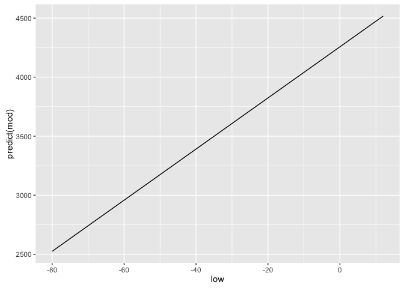<!-- -->

Логично, что для построения этого графика мы использовали geom = "line", что равнозначно использованию `+geom_line()`, т.к. наша зависимость линейна и это именно тот тип графика, коорый мы хотим получить. Меж тем, ggplot позволяет нам построить модель модел прямо при создании графика и, как ни странно мы уже делали это на предыдущих занятиях. Для этого существует уже хорошо известная нам геометрия `geom_smooth()`. Правда для того чтобы получить аналогичный предыдущему график, мы должны явно объявить функции геометри тот тип, что мы успользовали, т.е. `geom_smooth(method=lm)`, соответственно ggplot будет знать что наша модель будет иметь оббщий вид `lm(x~y, crime)`. Добавление параметра `se=FALSE` уберет доверительные интервалы, которые чаще вводят в заблуждение, чем помогают.

``` r
qplot(low, tc2009, data = crime) + 
  geom_smooth(method = lm)
```

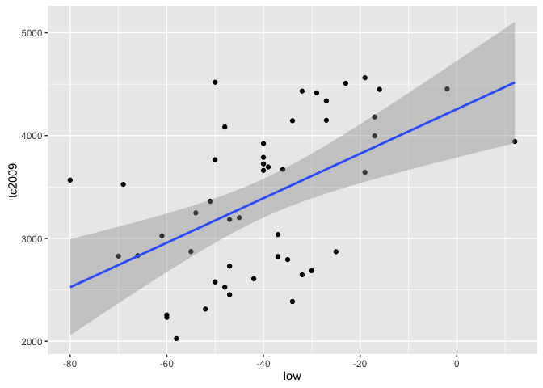<!-- -->

``` r
qplot(low, tc2009, data = crime) +
  geom_smooth(se = FALSE, method = lm)
```

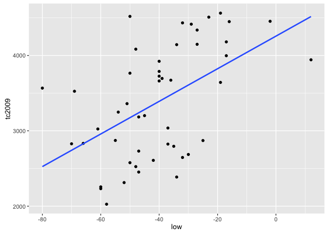<!-- -->

***Важно***. По умолчанию R пытается добавить \(\alpha\) в каждую линейную модель . Т.е. R строит модель исходя из того, что \(\alpha\) не равна 0. Меж тем мы можем заставить R строить модель исходя из того, что \(\alpha\) равна 0. Т.е. график нашей функйии должен обязательно проходить через координаты (0, 0).

Для того чтобы R исходил из того, что \(\alpha\) равна 0 в формулу модели нужно добавить 0 или -1. Добавление к формуле +1 заставляет R стоить модель исходя из того, что \(\alpha\) не равна 0. Рассмотрим следующие примеры:

Включаем \(\alpha\) в модель

``` r
lm(tc2009 ~ 1 + low, data = crime)
```

    ## 
    ## Call:
    ## lm(formula = tc2009 ~ 1 + low, data = crime)
    ## 
    ## Coefficients:
    ## (Intercept)          low  
    ##     4256.86        21.65

``` r
lm(tc2009 ~ low, data = crime)
```

    ## 
    ## Call:
    ## lm(formula = tc2009 ~ low, data = crime)
    ## 
    ## Coefficients:
    ## (Intercept)          low  
    ##     4256.86        21.65

``` r
qplot(low, predict(lm(tc2009 ~ 1 + low, data = crime)), data = crime, geom = "line")
```

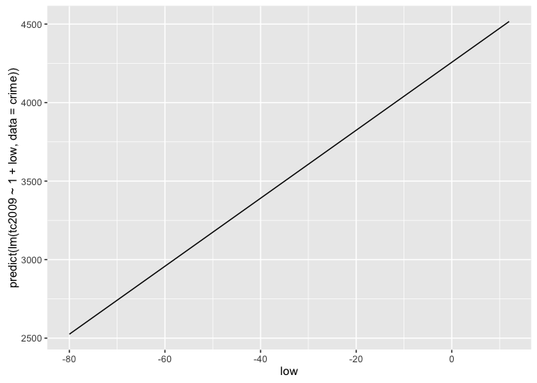<!-- -->

Исключаем \(\alpha\) из модели

``` r
lm(tc2009 ~ low - 1, data = crime)
```

    ## 
    ## Call:
    ## lm(formula = tc2009 ~ low - 1, data = crime)
    ## 
    ## Coefficients:
    ##    low  
    ## -67.36

``` r
lm(tc2009 ~ 0 + low, data = crime)
```

    ## 
    ## Call:
    ## lm(formula = tc2009 ~ 0 + low, data = crime)
    ## 
    ## Coefficients:
    ##    low  
    ## -67.36

``` r
qplot(low, predict(lm(tc2009 ~ low - 1, data = crime)), data = crime, geom = "line")
```

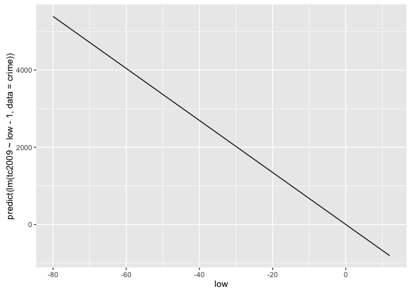<!-- -->

Как вы могли заметить включение или исключение $$ коренным образом меняет нашу модель. Поэтому к подобному приему стоит прибегать только в тех случаях когда вы точно уверены в том, что ваша функция проходит или не проходит через начало координат.

Давайте теперь воспользуемся другим набором данных, который мы уже успели загрузить - wages. Данная таблица содержит данные, которые были собраны для попытки описания зависимости заработка человека от его роста. Давайте построим модель, которая будет описывать такую зависимость и попытаемся интерпретировать результат.

``` r
hmod <- lm(earn ~ height, data = wages)
coef(hmod)
```

    ## (Intercept)      height 
    ## -126523.359    2387.196

Давайте подставим полученные коэффициенты в общее уравнение линейной регрессии \(earn=\alpha+\beta\times height+\epsilon\). В результате мы получим следующее уравнение:

\(earn=-126523.36+2387.20\times height+\epsilon\)

Давайте вспомним, что присутствующий в конце многочлена элемент \(\epsilon\) является показателем того, что наша модель не модет быть абсолютной точной, а потому всегда присутствует отклонение от реальных данных. Все эти отклонения и представлены элементом \(\epsilon\). Т.к. мы не знаем ошибки для каждого конкретного значения, в представлении уравнения мы будем брать \(\epsilon\) равным нулю, но при этом помнить, что отклонение существует.

Данные по росту представлены в дюймах. Поэтому для человека высотой 68 дюймов(1,72 метра) расчетная по данным нашей модели зарплата составит

\(earn=-126523.36+2387.20\times 68+\epsilon\)

\(earn=35806.24\)

Еще одним довольно простым выводом из нашей моедли будет то, что уведичение роста на 1 дюйм должно приводить к росту доходов на $2387.20 в год.

``` r
qplot(height, earn, data = wages, alpha = I(1/4)) +
  geom_smooth(se = FALSE, method = lm) + theme_bw()
```

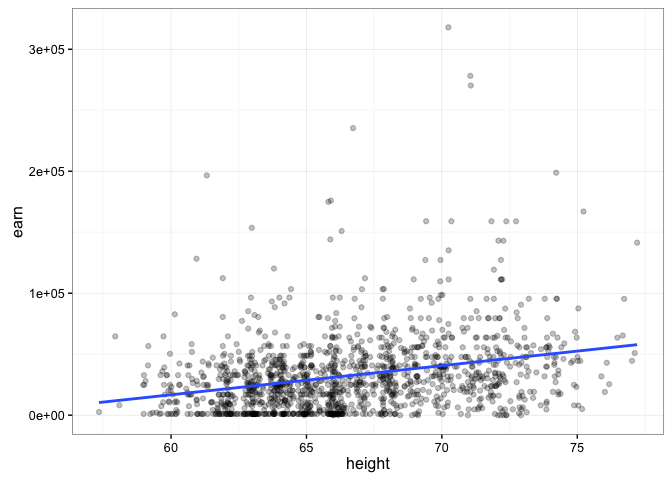<!-- -->

##### Давайте подведем небольшой итог

Подгонка модели в R состоит из 3 этапов:

1.  Описание отношений между интересующими нас переменными с помощью формул:`earn ~ height`

2.  Использование специальных формул для "подгонки"(создания) модели по заданной ранее формуле: `mod <- lm(earn ~ height, data = wages)`

3.  Анализ полученного результата различными способами: `summary(mod)` `plot(mod)`

Анализ модели и статистические выводы
-------------------------------------

Довольно очевидно, что модно получить модели описывающие связи между совершенно не связанными данными. Тогда перед нами встает вопрос того, а как мы можем быть уверены, что связь, которую нам "отыскала" модель существует и хоть сколько-нибудь точна. Наименьшая сумма квадратов отклонений, конечно хороший показатель, но надо понимать, что этот показатель ничего нам не гарантирует.

Если вернуться от общего описания к более статистическому, модель, которую мы получаем благодаря R, представляет только тот небольшой объем данных, что у нас есть, или выборку. Нас же всегда интересует модель, которая описывает генеральную совокупность. Таким образом, больше всего в полученной нами модели нас будет интересовать то, на сколько она отличается от модели генеральной совокупности.

Давайте загрузим данные которые содержат 100 совершенно случайно отобранных значений из предыдущего наббра данных и построим график полученных данных.

``` r
w1 <- read.csv("https://dl.dropboxusercontent.com/s/qnybbt5sxiedsd7/w1.csv?dl=0")
qplot(height, earn, data = w1) +  geom_smooth(method = lm, se = F)
```

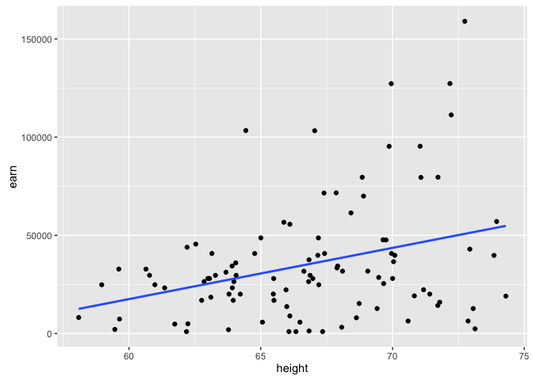<!-- -->

Построим аналогичный график для всего объема доступных данных.

``` r
qplot(height, earn, data = wages) +  geom_smooth(method = lm, se = F)
```

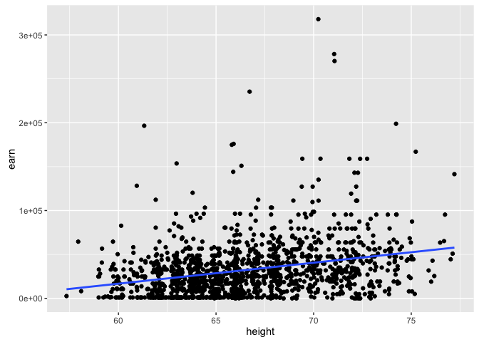<!-- -->

Давайте зададимся вопросом о том, а что будет если мы возьмем другую выборку? Будет ли \(\beta\) = \(\beta\) если мы возьмем другую выборку? Скорее всего нет. Будет ли \(\beta\) = 0, если мы возьмем другую выборку? Возможно.

Следует сделать важное отступление. Значение \(\beta\) = 0 сильно отличается по важности для нас от всех остальных значений, т.к. оно будет значить, что изменение независимой переменной не приводит к изменению зависимой переменной. Другими словами, оно будет значить, что у нас нет связи между нашими перемеными.

А каков инетрвал в котором лежат все возможные значения \(\beta\)?

Для ответа на этот вопрос есть два инструментальных подхода - подходы для рассуждений о неопределенности параметров модели

-   параметрическая статистика
-   непараметрическая статистика (бутстрапирование или самонастройка)

### Параметрическая статистика

Если модель удовлетворяет ряду предположений, то существует возможность вычислить вероятность наблюдения определнной β, даже в то время как истинная β=0. Если вы вспомните курс статистики, то поймете, что мы просто дургими словами сформулировали нулевую гипотезу для регрессионого анализа. Которая состояла в том, что генеральный угловой коэффициент линии регрессии β равен нулю.

Для того, чтобы разобраться в этом глубже, давайте рассмотрим конкретный пример. Для этого вернемся к модели зависимости заработка от роста: `hmod`:

``` r
summary(hmod)
```

    ## 
    ## Call:
    ## lm(formula = earn ~ height, data = wages)
    ## 
    ## Residuals:
    ##    Min     1Q Median     3Q    Max 
    ## -47903 -19744  -5184  11642 276796 
    ## 
    ## Coefficients:
    ##             Estimate Std. Error t value Pr(>|t|)    
    ## (Intercept)  -126523      14076  -8.989   <2e-16 ***
    ## height          2387        211  11.312   <2e-16 ***
    ## ---
    ## Signif. codes:  0 '***' 0.001 '**' 0.01 '*' 0.05 '.' 0.1 ' ' 1
    ## 
    ## Residual standard error: 29910 on 1377 degrees of freedom
    ## Multiple R-squared:  0.08503,    Adjusted R-squared:  0.08437 
    ## F-statistic:   128 on 1 and 1377 DF,  p-value: < 2.2e-16

Рассмотрим подробнее предложенную нам выдачу. `#      Estimate Std. Error t value   Pr(>|t|)` \``# height   2387        211   11.312    <2e-16 ***`

Вероятность того, что \(\beta_{height} >= 2387\) при условии, что истинная \(\beta=0\) в представленном нам примере практически равна 2е-16 (практически 0). Или другими словами, вероятность нулевой гипотезы равна предельно малой ввеличине, а значит мы можем сказать, что \(\beta\) не равен нулю.

Если быть совсем точными, низки p-значения ( &lt; 0.05), могут быть результатом следующих событий 1. У нас крайне не репрезентативная выборка 2. Истинная β генеральной совокупности не равна 0 3. Наша модель в принципе не корректна

Возникает логичный вопрос, но если мы доказали что β не ноль, то чему же она равна. К сожалению у нас нет других данных, кроме полученных от модели, поэтому наиболее правильным будет предположить, что β = 2387.

Заметим, однако, что найденное нами наиболее вероятное точечное значение β при повторных измерениях может оказаться иным. Чтобы охарактеризовать эту неопределенность, необходимо рассчитать доверительный интервал – не противоречащий имеющимся данным диапазон значений, в котором находится истинное значение нашей величины с определенной вероятностью (например, 95%). Ориентировочно оценить границы доверительного интервала можно, предположив, что примерно 95% всех значений распределения оценок β лежат в диапазоне ±2\(SE_{\beta}\) относительно его среднего значения, где \(SE_{\beta}\) – стандартная ошибка параметра β. Однако неопределенность имеется в отношении не только оценки параметра β, но и оценки его стандартного отклонения для соответствующего нормального распределения. Не углубляясь в детали, отметим, что в связи с этим обстоятельством более точные значения границ доверительного интервала дадут вычисления, основанные на свойствах t- распределения Стьюдента. Тогда границы 95%-го доверительного интервала для параметра β составят: β ± \(t_{0.975}SE_{\beta}\), где \(t_{0.975}\) – 0.975-квантиль t-распределения с (n - p) числом степеней свободы, n – объем выборки, а p – число параметров модели.

Полчить интервал для заданной точности можно следующей командой:

``` r
confint(hmod, level = 0.95)
```

    ##                   2.5 %     97.5 %
    ## (Intercept) -154135.798 -98910.920
    ## height         1973.228   2801.163

Еще раз, данные нам цифры означают, что мы можем с 95% вероятностью утверждать, что значение β находится в данном нам интервале от 1973.228 до 2801.163.

Расмотрим еще раз данные по связи между температурой и преступностью

``` r
mod <- lm(tc2009 ~ low, data = crime)
summary(mod)
```

    ## 
    ## Call:
    ## lm(formula = tc2009 ~ low, data = crime)
    ## 
    ## Residuals:
    ##      Min       1Q   Median       3Q      Max 
    ## -1134.36  -647.13    98.03   533.62  1344.30 
    ## 
    ## Coefficients:
    ##             Estimate Std. Error t value Pr(>|t|)    
    ## (Intercept)  4256.86     233.44  18.236  < 2e-16 ***
    ## low            21.65       5.33   4.061 0.000188 ***
    ## ---
    ## Signif. codes:  0 '***' 0.001 '**' 0.01 '*' 0.05 '.' 0.1 ' ' 1
    ## 
    ## Residual standard error: 649.9 on 46 degrees of freedom
    ## Multiple R-squared:  0.2639, Adjusted R-squared:  0.2479 
    ## F-statistic: 16.49 on 1 and 46 DF,  p-value: 0.000188

Как вы можете видеть, модель говорит нам, что существует достоверная связь между низкими температурами и уровнем преступности. С другой стороны, очень сложно себе представить какова реальная связь между низкими температурами и преступностью.

Этот пример должен вам напомнить о том, что низкие р значения не обязательно означают не нулевую \(\beta\). И в данном случае более верным будет предположить, что мы подобрали неверную модель или наша выборка крайне неудачна.

Какие же существуют способы сделать правильный вывод из полученных моделей? Давайте посмотрим на то как распределены наши данные построив графики, для двух таблиц, модели данных которых мы строили.

``` r
qplot(low, tc2009, data = crime)
```

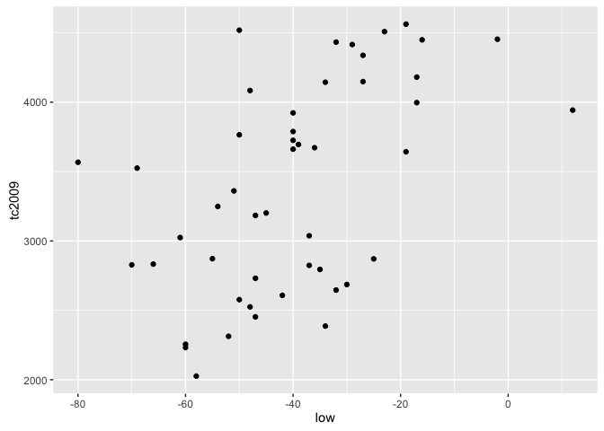<!-- -->

``` r
qplot(height, earn, data = wages)
```

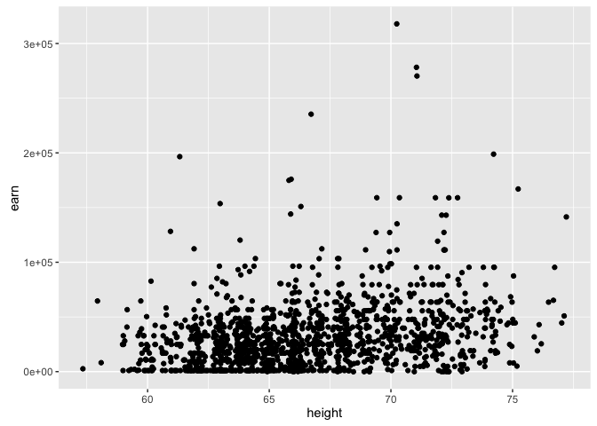<!-- -->

Первое, что сразу бросается в глаза, это то, что для первой модели линейная зависимость является вполне подходящим вариантом. А вот зависимость между переменными во второй таблице данных вряд ли является линейной.

В объекте содержащем модель есть данные для построения графиков по проверке ряда предположений. В первую очередь мы должны проверить предположение о нормальности распределения данных.

``` r
plot(mod)
```

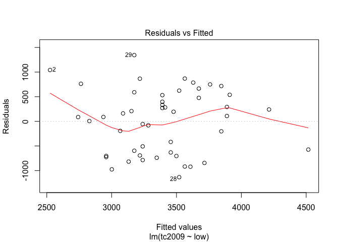<!-- -->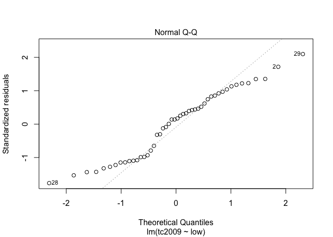<!-- -->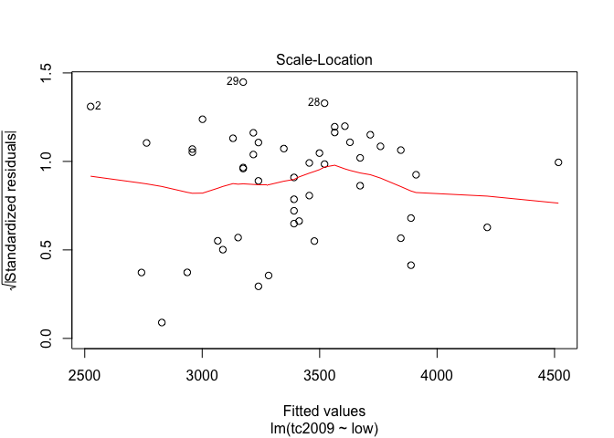<!-- -->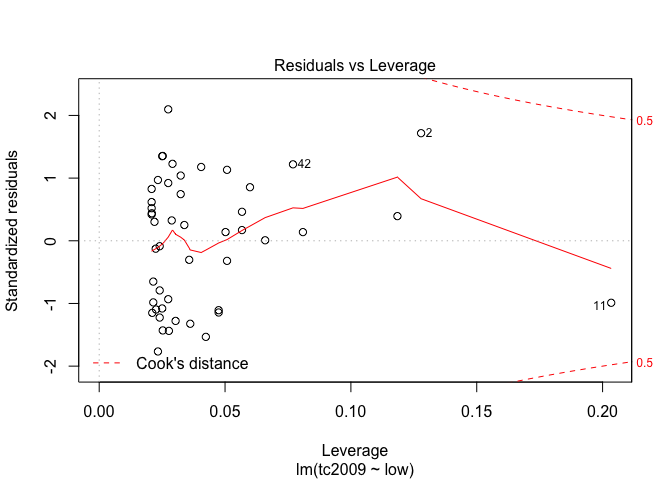<!-- -->

Первый и третий графики - Residuals vs Fitted и Scale-Location показывают зависимость отклонений от предсказанных моделью значений. Если на графике можно проследить хоть какую-то зависимость, то это означает, что отклонения не случайны и существует еще какой-то фактор воздействующий на изучаемую зависимую переменную, а значит мы должны усложнить нашу модель.

Второй график Normal Q-Q показывает распределение отклонений по квантилям. Чем ближе распределение к линейному, тем больше шанс того, что наши отклонения распределены нормально.

С помощью последнего графика вы можете определиьт точки, которые сильно отличаются от остальных и тем самым приводят к сильным отклонениям в модели. На графике прерывной линией показана зона при выходе точек за пределы которой стоит обратить на них пристальное внимание. Если такие точки имеются, то следует создать альтернативный набор данных, без этих точек, построить новую модель для уже для альтернативного набора данных и выбрать лучшую.

Множественное сравнение
-----------------------

До этого мы строили модели, используя только численные переменные. Давайте вспомним что у нас есть еще и категориальные значения называемые R факторами и рассмотрим следующий пример:

``` r
rmod <- lm(earn ~ race, data = wages)
coef(rmod)
```

    ##  (Intercept) racehispanic    raceother    racewhite 
    ##    28372.094    -2886.791     3905.320     4993.330

Мы попытались посторрить линейную модель зависимости заработка от расы. Если мы посмотрим на коэффициенты, то результат будет довольно неожиданный. Во первых, были посчитаны коэффициенты для каждого уровня фактора, а во вторых, у нас представлены не все уровни, напрмер у нас нет коэффициента для уровня "black".

Дело в том, что один из уровней переменной выбирается в качестве базового. Каждый последующий уровень получает некий номер в градации и для него расситывается отдельный коэффициент, которые показывает на сколько его коэффициент отличается от базового.

Т.к. мы не увидели коэффициента для черного населения, значит он и является базовым, т.е. 28372.09. Для испаноязычного населения итоговый коэффициент составит 28372.09 + -2886.79 = 25485.30. И для белого населения 28372.09 + 4993.33 = 33365.42

Т.к. итоговый показатель у испаноязычного населения самый низкий было бы логично сделать его базовым уровнем. Вы можете это сделать поменяв порядок уровней у фактора:

``` r
wages$race <- factor(wages$race, 
  levels = c("hispanic", "white", "black", "other"))
rmod2 <- lm(earn ~ race, data = wages)
coef(rmod2)
```

    ## (Intercept)   racewhite   raceblack   raceother 
    ##   25485.303    7880.121    2886.791    6792.111

Легко заметить, что не смотря на то, что значения коэффициентов поменялись, их результирующие значения остались прежними.

#### ANOVA

Давайте опять обратимся к вашим знаниям по статистике и задумаеся, а на что же похож регрессионый анализ для категориальных переменных? По сути в нем мы пытаемся сравнить различия между большой объединяющей группой и ее отдельными подгруппами, что очень похоже на дисперсионный анализ (ANOVA - Analysis of Variance). На самом деле это так и мы можем использовать данные дисперисонного анализа, применив команду anova() на нашу модель.

``` r
anova(rmod2)
```

    ## Analysis of Variance Table
    ## 
    ## Response: earn
    ##             Df     Sum Sq    Mean Sq F value  Pr(>F)  
    ## race         3 6.7924e+09 2264121503  2.3241 0.07328 .
    ## Residuals 1375 1.3395e+12  974196170                  
    ## ---
    ## Signif. codes:  0 '***' 0.001 '**' 0.01 '*' 0.05 '.' 0.1 ' ' 1

Помимо дисперсионного анализа существует множество подобных ему тестов, которыми вы тоже можете воспользоваться:

| Функция         | Тест                          | Статистика |
|-----------------|-------------------------------|------------|
| lm              | ANOVA                         | среднее    |
| aov             | ANOVA                         | среднее    |
| anova           | ANOVA                         | среднее    |
| oneway.test     | ANOVA для различных дисперсий | среднее    |
| pairwise.t.test | t тест множетсва групп        | среднее    |
| kruskal.test    | Kruskal Wallis Rank Sum       | сумма      |
| friedman.test   | Friedman Rank Sum             | сумма      |
| fligner.test    | Fligner-Killeen               | дисперсия  |
| bartlett.test   | Bartlett test                 | дисперсия  |

Давайте посмотрим зависимость заработка от пола. И существует ли статистически достоверная разница между зарплатами мужчи и женщин

``` r
smod <- lm(earn ~ sex, data = wages)
coef(smod)
```

    ## (Intercept)     sexmale 
    ##    24245.65    21747.48

``` r
wages$sex <- factor(wages$sex, 
  levels = c("male", "female"))
smod <- lm(earn ~ sex, data = wages)
coef(smod)
```

    ## (Intercept)   sexfemale 
    ##    45993.13   -21747.48

Итак, если мы возьмем мужскую зарплату в качестве базовой, она составит 45993, а женская будет меньше ее на 21747. Разница оказалась колосальной, поэтому давайте проверим на сколько эти данные стаистически достоверны:

``` r
anova(smod)
```

    ## Analysis of Variance Table
    ## 
    ## Response: earn
    ##             Df     Sum Sq    Mean Sq F value    Pr(>F)    
    ## sex          1 1.5320e+11 1.5320e+11  176.81 < 2.2e-16 ***
    ## Residuals 1377 1.1931e+12 8.6646e+08                      
    ## ---
    ## Signif. codes:  0 '***' 0.001 '**' 0.01 '*' 0.05 '.' 0.1 ' ' 1

Pr(&gt;F) &lt; 2.2e-16 \*\*\* говорит нам о том, что вероятность нулевой гипотезы равна нулю, а значит рассчитанная нашей моделью огромная разница является статистически достоверной. Гистограмма зарплат еще раз подтверждает нам это:

``` r
qplot(earn, data = wages, geom = "density", color = sex) + theme_bw()
```

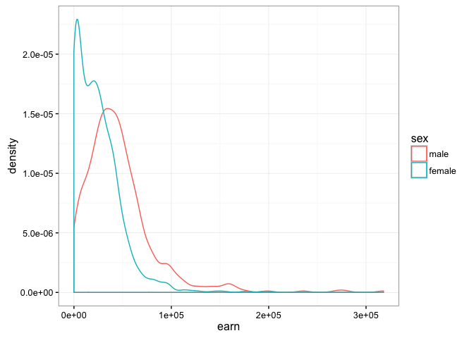<!-- -->

Построив аналогичный график для различных рас мы можем заметить, что разница между рассами не на столько принципиальная:

``` r
qplot(earn, data = wages, geom = "density", color = race) + theme_bw()
```

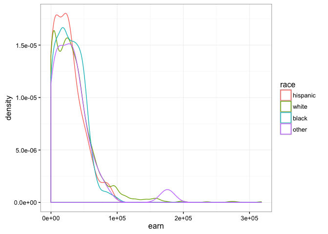<!-- -->

Оценка функций многих переменных
--------------------------------

До этого мы рассматривали зависимость одной переменной только от одной другой. Меж тем, R позволяет искать зависимость от неограниченного количества переменных. Напрмер построим модель зависимости заработка от роста

``` r
m1 <- lm(earn ~ height, data = wages)
coef(m1)
```

    ## (Intercept)      height 
    ## -126523.359    2387.196

А вот уже следующий код позволяет нам описать зависимость заработка от возраста и пола.

``` r
m2 <- lm(earn ~ height + sex, data = wages)
coef(m2)
```

    ## (Intercept)      height   sexfemale 
    ##  -15605.703     879.424  -16874.158

Второй коэффициент ожет быть интерпретирован как эффект от наличия женского пола ...когда рост рассматривается неизменным. Первый коэффициент может быть интерпретирован как изменения заработка в зависимости от роста ...при условии, что пол неизменен.

Следующий график демонстрирует две модели - зависимости заработка от роста для мужчин и женщин

``` r
qplot(height, earn, data = wages, alpha = I(1/10), color = sex) + theme_bw() + geom_line(aes(y = predict(m2)))
```

<!-- -->

Таким образом добавление дополнительной переменнйо по сути привело к разбиению нашей модели.

Обратимся к известному вам набору данный diamond и рассмотрим влияние типа огранки (cut) и количества карат в бриллианте на его стоимость:

``` r
qplot(price, data = diamonds, color = cut, geom = "density")
```

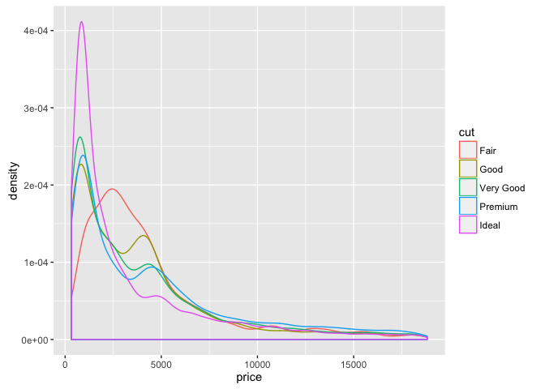<!-- -->

Построим две модели, с учетом и без учета веса бриллианта в каратах:

``` r
diamonds$cut <- as.character(diamonds$cut)

d1 <- lm(price ~ cut, data = diamonds)
coef(d1)
```

    ##  (Intercept)      cutGood     cutIdeal   cutPremium cutVery Good 
    ##    4358.7578    -429.8933    -901.2158     225.4999    -376.9979

``` r
d2 <- lm(price ~ cut + carat, data = diamonds)
coef(d2)
```

    ##  (Intercept)      cutGood     cutIdeal   cutPremium cutVery Good 
    ##    -3875.470     1120.332     1800.924     1439.077     1510.135 
    ##        carat 
    ##     7871.082

Если мы посмотрим на данные модели не учитывавшей вес бриллианта, мы увидим странную картину, когда стоимость бриллианта с идеальной агранкой сильно меньше, чем у бриллианта с хорошей и очень хорошей огранкой. Но если в модели учесть вес (а значит и размер) бриллианта, то все становится на свои места. И бриллианты с идеальной агранкой в этой модели стоят дороже, но с учетом их "каратности".

Описанное выше прекрасно видно на следующем графике:

``` r
qplot(carat, predict(d2), data = diamonds, color = cut, geom = "line")
```

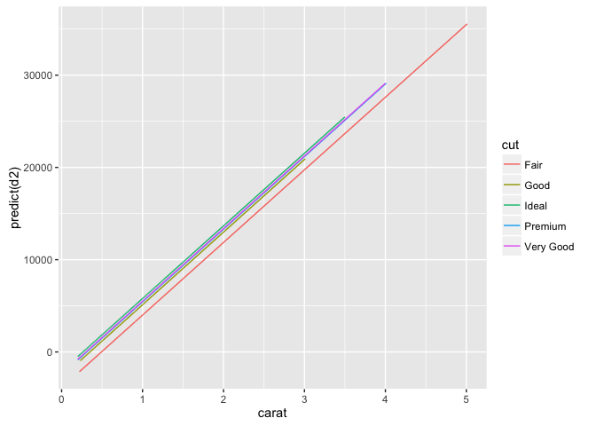<!-- -->

#### Подобный эффект от введения дополнительной переменной широко известен и даже имеет собственное имя - парадокс Симпсона

Суть его состоит в том, что связь между двумя переменными может измениться, если учесть, третью, связанную с ними переменную.

#### Т.к. эта проблема хорошо известна, у нее существует и стандартное решение:

Моделируйте каждый источник изменений в системе одновременно

Создадим новую модель, которая предсказывает заработок в зависимости от роста, пола, расы, образования и возраста.И попытаемся ответить на вопрос существует ли связь между высотой и заработком? А между полом и заработком?

``` r
m3 <- lm(earn ~ height + sex + race + ed + age, data = wages)
coef(m3)
```

    ## (Intercept)      height   sexfemale   racewhite   raceblack   raceother 
    ## -74354.1693    632.7391 -17552.5441   4592.7865   2086.0663   1708.3196 
    ##          ed         age 
    ##   4382.0853    287.4744

Символ . используется в формуле, как обозначение всех остальных переменных. Т.е. мы можем описать такую же модель с помощью кода:

``` r
lm(earn ~ height + sex + race + ed + age, data = wages)
```

    ## 
    ## Call:
    ## lm(formula = earn ~ height + sex + race + ed + age, data = wages)
    ## 
    ## Coefficients:
    ## (Intercept)       height    sexfemale    racewhite    raceblack  
    ##    -74354.2        632.7     -17552.5       4592.8       2086.1  
    ##   raceother           ed          age  
    ##      1708.3       4382.1        287.5

``` r
lm(earn ~ ., data = wages)
```

    ## 
    ## Call:
    ## lm(formula = earn ~ ., data = wages)
    ## 
    ## Coefficients:
    ## (Intercept)       height    sexfemale    racewhite    raceblack  
    ##    -74354.2        632.7     -17552.5       4592.8       2086.1  
    ##   raceother           ed          age  
    ##      1708.3       4382.1        287.5

Подобную запись, с использованием знака . можно модифицировать отнимая от нее отдельные переменные:

``` r
lm(earn ~ height + sex + race + ed, data = wages)
```

    ## 
    ## Call:
    ## lm(formula = earn ~ height + sex + race + ed, data = wages)
    ## 
    ## Coefficients:
    ## (Intercept)       height    sexfemale    racewhite    raceblack  
    ##    -46648.9        440.6     -18036.5       6128.5       2915.6  
    ##   raceother           ed  
    ##      3379.3       4159.8

``` r
lm(earn ~ . - age, data = wages)
```

    ## 
    ## Call:
    ## lm(formula = earn ~ . - age, data = wages)
    ## 
    ## Coefficients:
    ## (Intercept)       height    sexfemale    racewhite    raceblack  
    ##    -46648.9        440.6     -18036.5       6128.5       2915.6  
    ##   raceother           ed  
    ##      3379.3       4159.8

Условия взаимодействия переменных
=================================

До этого мы исходили из того, что каждая из независимых переменных не влияет на другую. Что, например очевидно не верно для пола и роста, т.к. средний рост женщин меньше. Для того, чтобы R учитывал при моделировании взаимодействие независимых переменных, мы должны будем добавить к формуле еще одну переменную, которая описывает взаимодействие этих переменных между собой. Так для вышеупомянутых роста и пола итоговая формула модели будет выглядеть так:

``` r
m4 <- lm(earn ~ height + sex + height:sex,   data = wages)
coef(m4)
```

    ##      (Intercept)           height        sexfemale height:sexfemale 
    ##      -42677.4003        1265.9167       30510.4336        -701.4065

Что означают полученные коэффициенты? Для мужчин увеличение роста на 1 дюйм приведет к увеличению заработка на 1265.92. Для женщин увеличение роста на 1 дюйм приведете к увеличению заработка на 1265.92 + (-701.41) = 564.51.

Если мы построим графики двух предсказаний двух моделей, то сможем заметить, что у модели с учетом взамиодействия переменных прямые для мужчин и женщин перестали быть параллельны. Что означает, чтоизменение в росте у мужчин и женщин будет приводить к разному росту зарплат.

``` r
qplot(height, earn, data = wages, alpha = I(1/10), color = sex) + theme_bw() + geom_line(aes(y = predict(lm(earn ~ height + sex,   data = wages))))
```

<!-- -->

``` r
qplot(height, earn, data = wages, alpha = I(1/10), color = sex) + theme_bw() + geom_line(aes(y = predict(m4)))
```

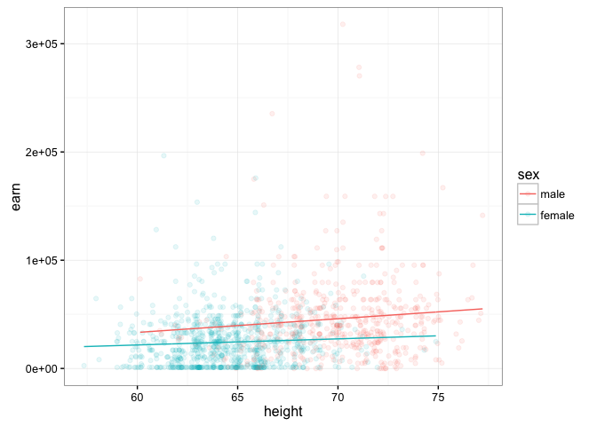<!-- -->

Итак, функция вида

``` r
lm(earn ~ height + sex + height:sex, data = wages)
```

    ## 
    ## Call:
    ## lm(formula = earn ~ height + sex + height:sex, data = wages)
    ## 
    ## Coefficients:
    ##      (Intercept)            height         sexfemale  height:sexfemale  
    ##         -42677.4            1265.9           30510.4            -701.4

будет предсказывать значение заработка по значению роста...с учетом значения пола ...и с учетом взаимодествия между переменными рост и пол

##### Важно: порядок переменных в формуле имеет первостененное значение y~x+z и y~z+x это две разные модели

``` r
lm(earn ~ height * sex, data = wages)
```

    ## 
    ## Call:
    ## lm(formula = earn ~ height * sex, data = wages)
    ## 
    ## Coefficients:
    ##      (Intercept)            height         sexfemale  height:sexfemale  
    ##         -42677.4            1265.9           30510.4            -701.4

Знак \* служит сокращенной записью обозначения того, что мы хотим рассмотреть влияние этих двух переменных на зависимую переменную и хотим учесть их взаимодействие между собой.

Запись ^2 обозначает, что в модели нужно учесть все взаимодействия первого порядка(с одной переменной - +) и все взаимодействия второго порядка (взаимодействия переменных между собой - :)

``` r
lm(earn ~ height + sex + height:sex, data = w1)
```

    ## 
    ## Call:
    ## lm(formula = earn ~ height + sex + height:sex, data = w1)
    ## 
    ## Coefficients:
    ##    (Intercept)          height         sexmale  height:sexmale  
    ##       -31845.8           868.3        139602.2         -1683.4

``` r
lm(earn ~ height * sex, data = w1)
```

    ## 
    ## Call:
    ## lm(formula = earn ~ height * sex, data = w1)
    ## 
    ## Coefficients:
    ##    (Intercept)          height         sexmale  height:sexmale  
    ##       -31845.8           868.3        139602.2         -1683.4

``` r
lm(earn ~ (height + sex)^2, data = w1)
```

    ## 
    ## Call:
    ## lm(formula = earn ~ (height + sex)^2, data = w1)
    ## 
    ## Coefficients:
    ##    (Intercept)          height         sexmale  height:sexmale  
    ##       -31845.8           868.3        139602.2         -1683.4

Если мы захотим рассмотреть модель с тремя независимыми переменными,например добавим в нашу модель рассу, то у нас появяться взаимодействия и третьего порядка - height:sex:race

Тогда мы можем использовать запись ^3, которая будет обозначать, что в модели надо использовать все взаимодействия первого, второго и третьего порядка.

``` r
lm(earn ~ (height + sex + race)^3,data = w1)
```

    ## 
    ## Call:
    ## lm(formula = earn ~ (height + sex + race)^3, data = w1)
    ## 
    ## Coefficients:
    ##                 (Intercept)                       height  
    ##                     -166395                         2944  
    ##                     sexmale                 racehispanic  
    ##                      491439                       183266  
    ##                   raceother                    racewhite  
    ##                      385211                       128984  
    ##              height:sexmale          height:racehispanic  
    ##                       -7062                        -2437  
    ##            height:raceother             height:racewhite  
    ##                       -6064                        -1993  
    ##        sexmale:racehispanic            sexmale:raceother  
    ##                          NA                           NA  
    ##           sexmale:racewhite  height:sexmale:racehispanic  
    ##                     -396323                           NA  
    ##    height:sexmale:raceother     height:sexmale:racewhite  
    ##                          NA                         6052

``` r
qplot(height, earn, data = w1, alpha = I(1/10), color = sex) + theme_bw() + geom_line(aes(y = predict(lm(earn ~ (height + sex + race)^3,data = w1))))
```

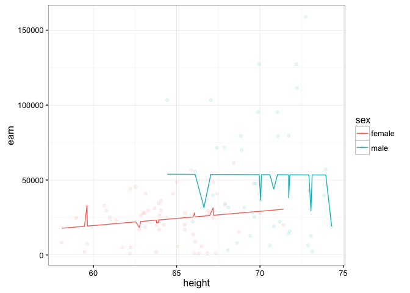<!-- -->

#### Шпаргалка по формулам моделирования в R

-   '~' Отделяет зависимые переменные справа от независимых переменных слева. К примеру, формула зависимости y от x, z, и w будет выглядеть как y ~ x + z + w.
-   '+' Разделяет независимые переменные.
-   ':' Обозначает взаимодействие между независимыми переменными. Описание y как величины зависимой от x, z, и взаимодействия между x и z будет выглядеть как y ~ x + z + x:z.
-   '*' Короткая запись всех возможных взаимодействий между переменными. Код y ~ x * z \* w равнозначен y ~ x + z + w + x:z + x:w + z:w + x:z:w.
-   '^' Обозначает взаимодействие определенного уровня. Так код y ~ (x + z + w)^2 равнозначен y ~ x + z + w + x:z + x:w + z:w.
-   '.' Краткая запись обозначающая все остальные переменные в таблице кроме зависимой переменной. Например, если таблица содержит переменные x, y, z, и w, тогда код y ~ . будет равнозначен y ~ x + z + w.
-   '-' Знак миинуса убирает переменную из формулы. Например, y ~ (x + z + w)^2 – x:w равнозначно y ~ x + z + w + x:z + z:w.
-   '-1' Убирает первый коэфициент, заставляя график модельной функции проходить через начало координат .
-   'I()' Элементы внутри скобок интерпретируются численно. Например, y ~ x + (z + w)^2 равнозначно y ~ x + z + w + z:w. Но, код y ~ x + I((z + w)^2) равнозначен y ~ x + h, где h новая переменная, полученная возведением в квадрат суммы z и w.
-   'function' Любая математическая функция может быть использована в формуле. Например, log(y) ~ x + z + w попытается описать зависимость log(y) от x, z, и w.

#### Анализ моделей множественной регресии

Все задачи, что стояли перед нами по анализу моделей линейной регресси актуальны и здесь. Но для моделей множественной регрессии появляется еще одна задача - определение вклада каждой отдеьной переменной в итоговую модель и заключение о ее необходимости пребывания в оной.

Еще одна проблема, кроме того, что переменные, которые вы добавили могут незначительно влиять на вашу модель, заключается в том, что если присутствующие в модели переменные кореллируют, это может вносить сильную ошибку в их р-значения.

Для того чтобы избежать подобной ситуации, известной под названием мультиколлинеарность, вам придется проверить коэффиценты корреляции для всех ваших переменных:

``` r
cor(wages$height, wages$ed)
```

    ## [1] 0.1140473

``` r
cor(wages$height, wages$age)
```

    ## [1] -0.1337271

``` r
cor(wages$height, as.numeric(wages$sex))
```

    ## [1] -0.7036717

Если некоторые из ваших переменных значимо коррелируют, то вам надо выбрать одну из них, отказавшись от другой.

Помимо этих проблем, для моделей соержащих множество переменных проблемой становится то, что с увеличением количества переменных увеличивает шанс того, для какой-то из переменных мы полим неадекватные р-значение просто в результате неудачной выборки.

Например, р-значение &lt; 0.05 будет каждым двадцатым среди бесконечного множества p-значений, просто по закону больших чисел.

Тогда, вероятность того, что хотя бы одно р-значение &lt; 0.05 = 0.05. Вероятность того, что хотя бы одно из двух р-значений &lt; 0.05 = 0.098.
... ... ... Вероятность того, что хотя бы одно из двадцати р-значений &lt; 0.05 = 0.64

Для того, чтобы не отвергнуть реально влияющие на вашу модель переменные в результате такого эффекта рекомендуется использовать один из следующи подходов

1.  Использовать более низкое α значение для определения значимости (например равное α / p)
2.  Проверять в первую очередь то, чо вся модель статистически значима и уже исходя из этого принимать решение об исключении той или иной переменной.

Например, для модели m4

``` r
summary(m4)
```

    ## 
    ## Call:
    ## lm(formula = earn ~ height + sex + height:sex, data = wages)
    ## 
    ## Residuals:
    ##    Min     1Q Median     3Q    Max 
    ## -49699 -20090  -5034  11553 271709 
    ## 
    ## Coefficients:
    ##                  Estimate Std. Error t value Pr(>|t|)   
    ## (Intercept)      -42677.4    30488.0  -1.400  0.16180   
    ## height             1265.9      434.9   2.911  0.00366 **
    ## sexfemale         30510.4    39644.1   0.770  0.44166   
    ## height:sexfemale   -701.4      585.8  -1.197  0.23141   
    ## ---
    ## Signif. codes:  0 '***' 0.001 '**' 0.01 '*' 0.05 '.' 0.1 ' ' 1
    ## 
    ## Residual standard error: 29340 on 1375 degrees of freedom
    ## Multiple R-squared:  0.1205, Adjusted R-squared:  0.1186 
    ## F-statistic: 62.82 on 3 and 1375 DF,  p-value: < 2.2e-16

р-значение модели будет меньше 2.2е-16, что означает то, что ваша модель достоверно лучше предсказывает значения переменной, чем абсолютно произвольный их перебор.

Для сравнения моделей вы можете воспользоваться фунцией anova()

``` r
anova(m1, m4)
```

    ## Analysis of Variance Table
    ## 
    ## Model 1: earn ~ height
    ## Model 2: earn ~ height + sex + height:sex
    ##   Res.Df        RSS Df  Sum of Sq      F    Pr(>F)    
    ## 1   1377 1.2318e+12                                   
    ## 2   1375 1.1840e+12  2 4.7797e+10 27.753 1.528e-12 ***
    ## ---
    ## Signif. codes:  0 '***' 0.001 '**' 0.01 '*' 0.05 '.' 0.1 ' ' 1

Полученные данные означают, что модель m4 имеет значимую разнцу в точности предсказания по сравнению с моделью m1. Т.е. другими словами, т.к. разница между моделями заключалась в наличии в модели m4 переменной пол(sex), то включение переменной пол в нашу модель улучшает ее точность, а значит переменная пол имеет право в ней присутствовать.

Если мы рассмотрим данные, полученные от функции anova() только для одной модели m4, то мы увидим, что

``` r
anova(m4)
```

    ## Analysis of Variance Table
    ## 
    ## Response: earn
    ##              Df     Sum Sq    Mean Sq  F value    Pr(>F)    
    ## height        1 1.1448e+11 1.1448e+11 132.9410 < 2.2e-16 ***
    ## sex           1 4.6562e+10 4.6562e+10  54.0720 3.307e-13 ***
    ## height:sex    1 1.2343e+09 1.2343e+09   1.4334    0.2314    
    ## Residuals  1375 1.1840e+12 8.6112e+08                       
    ## ---
    ## Signif. codes:  0 '***' 0.001 '**' 0.01 '*' 0.05 '.' 0.1 ' ' 1

р-значение для переменной height:sex больше предельного р-знаения, а значит, модель содержащая переменные heights + sex + heights:sex не значимо лучше чем модель содержащая переменные heights + sex, а значит от переменной height:sex мы можем отказаться.

#### Итоговый алгоритм исследования модели будет заключаться в получении и интерпретации следующих значений

-   Коэффициенты - coef(mod)
-   Остатки - resid(mod)
-   Доверительный интервал - confint(mod)
-   P-значения - summary(mod)
-   Сравнение вариантов модели - anova(mod1, mod2)
